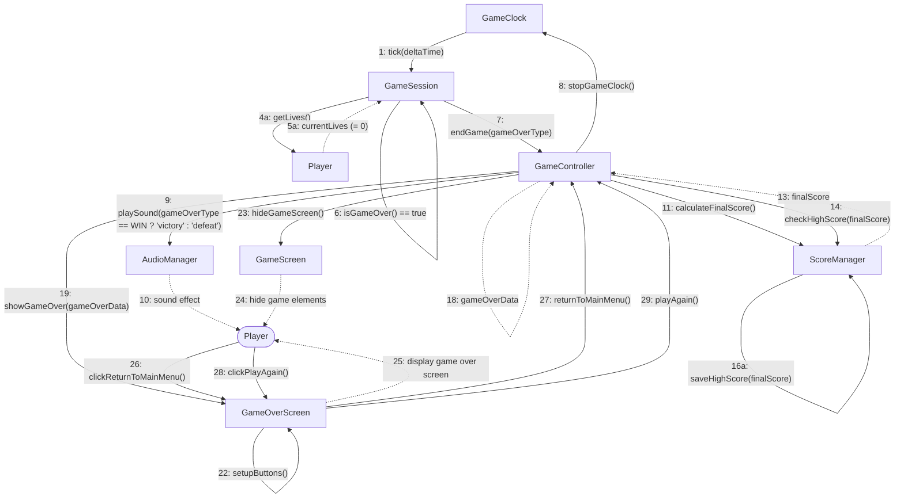

# Communication Diagram: Game Over

```mermaid
graph TD
    GameClock[GameClock]
    GameSession[GameSession]
    PlayerModel[Player]
    GameController[GameController]
    AudioManager[AudioManager]
    ScoreManager[ScoreManager]
    GameOverScreen[GameOverScreen]
    GameScreen[GameScreen]
    Player([Player])

    GameClock -->|"1: tick(deltaTime)"| GameSession
    GameSession -->|"2: update(deltaTime)"| GameSession
    
    GameSession -->|"3a: checkLives()"| GameSession
    GameSession -->|"4a: getLives()"| PlayerModel
    PlayerModel -.->|"5a: currentLives (= 0)"| GameSession
    
    GameSession -->|"3b: checkWaveStatus()"| GameSession
    GameSession -->|"4b: enemiesRemaining() == 0 && wavesRemaining() == 0"| GameSession
    
    GameSession -->|"6: isGameOver() == true"| GameSession
    GameSession -->|"7: endGame(gameOverType)"| GameController
    
    GameController -->|"8: stopGameClock()"| GameClock
    GameController -->|"9: playSound(gameOverType == WIN ? 'victory' : 'defeat')"| AudioManager
    AudioManager -.->|"10: sound effect"| Player
    
    GameController -->|"11: calculateFinalScore()"| ScoreManager
    ScoreManager -->|"12: sumPoints()"| ScoreManager
    ScoreManager -.->|"13: finalScore"| GameController
    
    GameController -->|"14: checkHighScore(finalScore)"| ScoreManager
    ScoreManager -->|"15a: isHighScore(finalScore) == true"| ScoreManager
    ScoreManager -->|"16a: saveHighScore(finalScore)"| ScoreManager
    
    GameController -->|"17: createGameOverData(gameOverType, finalScore)"| GameController
    GameController -.->|"18: gameOverData"| GameController
    
    GameController -->|"19: showGameOver(gameOverData)"| GameOverScreen
    GameOverScreen -->|"20: setupUI(gameOverData)"| GameOverScreen
    GameOverScreen -->|"21: displayStats()"| GameOverScreen
    GameOverScreen -->|"22: setupButtons()"| GameOverScreen
    
    GameController -->|"23: hideGameScreen()"| GameScreen
    GameScreen -.->|"24: hide game elements"| Player
    
    GameOverScreen -.->|"25: display game over screen"| Player
    
    Player -->|"26: clickReturnToMainMenu()"| GameOverScreen
    GameOverScreen -->|"27: returnToMainMenu()"| GameController
    
    Player -->|"28: clickPlayAgain()"| GameOverScreen
    GameOverScreen -->|"29: playAgain()"| GameController
``` 