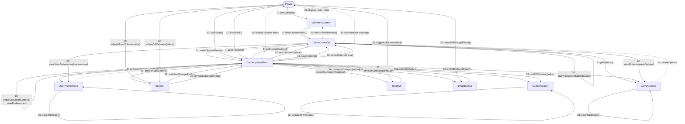

# Communication Diagram: Open Options

```mermaid
graph TD
    Player([Player])
    MainMenuScreen[MainMenuScreen]
    GameOptionsMenu[GameOptionsMenu]
    GameController[GameController]
    GameOptions[GameOptions]
    UserPreferences[UserPreferences]
    AudioManager[AudioManager]
    SliderUI[SliderUI]
    ToggleUI[ToggleUI]
    DropdownUI[DropdownUI]

    Player -->|"1: clickOptions()"| MainMenuScreen
    MainMenuScreen -->|"2: showOptionsMenu()"| GameController
    GameController -->|"3: createOptionsMenu()"| GameOptionsMenu
    
    GameOptionsMenu -->|"4: getCurrentOptions()"| GameController
    GameController -->|"5: getOptions()"| GameOptions
    GameOptions -.->|"6: currentOptions"| GameController
    GameController -.->|"7: currentOptions"| GameOptionsMenu
    
    GameOptionsMenu -->|"8: getUserPreferences()"| UserPreferences
    UserPreferences -.->|"9: userPreferences"| GameOptionsMenu
    
    GameOptionsMenu -->|"10: setupUI(currentOptions, userPreferences)"| GameOptionsMenu
    GameOptionsMenu -->|"11: createAudioSliders()"| SliderUI
    GameOptionsMenu -->|"12: createGameplayToggles()"| ToggleUI
    GameOptionsMenu -->|"13: createVideoSettings()"| DropdownUI
    
    GameOptionsMenu -.->|"14: display options menu"| Player
    
    Player -->|"15: adjustMusicVolume(value)"| SliderUI
    SliderUI -->|"16: onValueChanged(value)"| GameOptionsMenu
    GameOptionsMenu -->|"17: setMusicVolume(value)"| AudioManager
    AudioManager -->|"18: updateMusicVolume()"| AudioManager
    
    Player -->|"19: adjustSFXVolume(value)"| SliderUI
    SliderUI -->|"20: onValueChanged(value)"| GameOptionsMenu
    GameOptionsMenu -->|"21: setSFXVolume(value)"| AudioManager
    AudioManager -->|"22: updateSFXVolume()"| AudioManager
    
    Player -->|"23: toggleFullscreen(value)"| ToggleUI
    ToggleUI -->|"24: onValueChanged(value)"| GameOptionsMenu
    GameOptionsMenu -->|"25: setFullscreen(value)"| GameController
    GameController -->|"26: applyFullscreenSetting(value)"| GameController
    
    Player -->|"27: selectDifficulty(difficulty)"| DropdownUI
    DropdownUI -->|"28: onValueChanged(difficulty)"| GameOptionsMenu
    GameOptionsMenu -->|"29: setDifficulty(difficulty)"| GameOptions
    
    Player -->|"30: clickSave()"| GameOptionsMenu
    GameOptionsMenu -->|"31: saveOptions()"| GameController
    GameController -->|"32: saveOptions(gameOptions)"| GameOptions
    GameOptions -->|"33: saveToStorage()"| GameOptions
    
    GameController -->|"34: saveUserPreferences(preferences)"| UserPreferences
    UserPreferences -->|"35: saveToStorage()"| UserPreferences
    
    GameOptionsMenu -.->|"36: confirmation message"| Player
    
    Player -->|"37: clickBack()"| GameOptionsMenu
    GameOptionsMenu -->|"38: closeOptionsMenu()"| GameController
    GameController -->|"39: returnToMainMenu()"| MainMenuScreen
    MainMenuScreen -.->|"40: display main menu"| Player
``` 