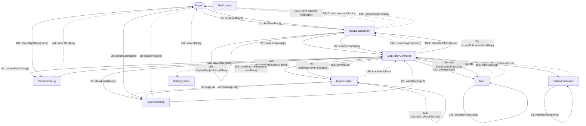

# Communication Diagram: Save and Load Map

```mermaid
graph TD
    Player([Player])
    MapEditorScreen[MapEditorScreen]
    MapEditorController[MapEditorController]
    FileBrowser[FileBrowser]
    SaveFileDialog[SaveFileDialog]
    LoadFileDialog[LoadFileDialog]
    MapSerializer[MapSerializer]
    Map[Map]
    ValidationService[ValidationService]
    DialogSystem[DialogSystem]

    Player -->|"1a: clickSaveMap()"| MapEditorScreen
    MapEditorScreen -->|"2a: requestSaveMap()"| MapEditorController
    
    MapEditorController -->|"3a: validateMap(map)"| ValidationService
    ValidationService -->|"4a: validateStructure()"| ValidationService
    ValidationService -->|"5a: validatePaths()"| ValidationService
    ValidationService -->|"6a: validatePlacement()"| ValidationService
    ValidationService -.->|"7a: validationResult"| MapEditorController
    
    MapEditorController -->|"8a1: showSaveDialog()"| SaveFileDialog
    SaveFileDialog -.->|"9a1: save file dialog"| Player
    
    MapEditorController -.->|"8a2: showValidationErrors(errors)"| DialogSystem
    DialogSystem -.->|"9a2: error display"| Player
    
    Player -->|"10a: enterMapName(name)"| SaveFileDialog
    SaveFileDialog -->|"11a: saveMap(name)"| MapEditorController
    
    MapEditorController -->|"12a: getMapData()"| Map
    Map -->|"13a: serializeToData()"| Map
    Map -.->|"14a: mapData"| MapEditorController
    
    MapEditorController -->|"15a: saveMapToFile(name, mapData)"| MapSerializer
    MapSerializer -->|"16a: serializeMap(mapData)"| MapSerializer
    MapSerializer -->|"17a: writeToFile(name, serializedData)"| MapSerializer
    MapSerializer -.->|"18a: saveResult"| MapEditorController
    
    MapEditorController -.->|"19a1: showSaveSuccess()"| MapEditorScreen
    MapEditorScreen -.->|"20a1: save success notification"| Player
    
    MapEditorController -.->|"19a2: showSaveError(error)"| MapEditorScreen
    MapEditorScreen -.->|"20a2: save error notification"| Player
    
    Player -->|"1b: clickLoadMap()"| MapEditorScreen
    MapEditorScreen -->|"2b: requestLoadMap()"| MapEditorController
    
    MapEditorController -->|"3b: showLoadDialog()"| LoadFileDialog
    LoadFileDialog -->|"4b: loadMapList()"| MapSerializer
    MapSerializer -.->|"5b: mapList"| LoadFileDialog
    LoadFileDialog -.->|"6b: display map list"| Player
    
    Player -->|"7b: selectMap(mapId)"| LoadFileDialog
    LoadFileDialog -->|"8b: loadMap(mapId)"| MapEditorController
    
    MapEditorController -->|"9b: loadMapFromFile(mapId)"| MapSerializer
    MapSerializer -->|"10b: readFromFile(mapId)"| MapSerializer
    MapSerializer -->|"11b: deserializeMap(fileData)"| MapSerializer
    MapSerializer -.->|"12b: loadedMapData"| MapEditorController
    
    MapEditorController -->|"13b: new Map(loadedMapData)"| Map
    Map -->|"14b: initializeFromData()"| Map
    Map -.->|"15b: initializedMap"| MapEditorController
    
    MapEditorController -->|"16b: updateEditor(initializedMap)"| MapEditorScreen
    MapEditorScreen -->|"17b: resetView()"| MapEditorScreen
    MapEditorScreen -->|"18b: displayMap(initializedMap)"| MapEditorScreen
    MapEditorScreen -.->|"19b: updated map display"| Player
``` 