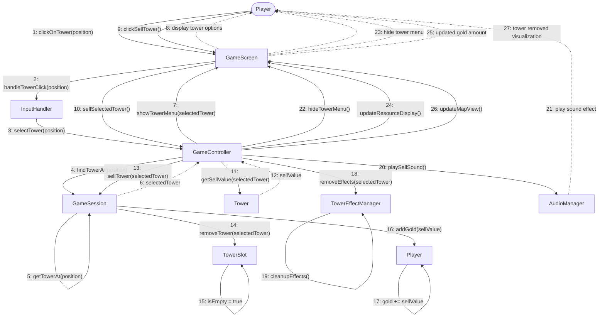

# Communication Diagram: Sell Tower

```mermaid
graph TD
    Player([Player])
    GameScreen[GameScreen]
    InputHandler[InputHandler]
    GameController[GameController]
    GameSession[GameSession]
    Tower[Tower]
    TowerSlot[TowerSlot]
    PlayerModel[Player]
    TowerEffectManager[TowerEffectManager]
    AudioManager[AudioManager]

    Player -->|"1: clickOnTower(position)"| GameScreen
    GameScreen -->|"2: handleTowerClick(position)"| InputHandler
    InputHandler -->|"3: selectTower(position)"| GameController
    GameController -->|"4: findTowerAt(position)"| GameSession
    GameSession -->|"5: getTowerAt(position)"| GameSession
    GameSession -.->|"6: selectedTower"| GameController
    
    GameController -->|"7: showTowerMenu(selectedTower)"| GameScreen
    GameScreen -.->|"8: display tower options"| Player
    
    Player -->|"9: clickSellTower()"| GameScreen
    GameScreen -->|"10: sellSelectedTower()"| GameController
    
    GameController -->|"11: getSellValue(selectedTower)"| Tower
    Tower -.->|"12: sellValue"| GameController
    
    GameController -->|"13: sellTower(selectedTower)"| GameSession
    GameSession -->|"14: removeTower(selectedTower)"| TowerSlot
    TowerSlot -->|"15: isEmpty = true"| TowerSlot
    
    GameSession -->|"16: addGold(sellValue)"| PlayerModel
    PlayerModel -->|"17: gold += sellValue"| PlayerModel
    
    GameController -->|"18: removeEffects(selectedTower)"| TowerEffectManager
    TowerEffectManager -->|"19: cleanupEffects()"| TowerEffectManager
    
    GameController -->|"20: playSellSound()"| AudioManager
    AudioManager -.->|"21: play sound effect"| Player
    
    GameController -->|"22: hideTowerMenu()"| GameScreen
    GameScreen -.->|"23: hide tower menu"| Player
    
    GameController -->|"24: updateResourceDisplay()"| GameScreen
    GameScreen -.->|"25: updated gold amount"| Player
    
    GameController -->|"26: updateMapView()"| GameScreen
    GameScreen -.->|"27: tower removed visualization"| Player
``` 