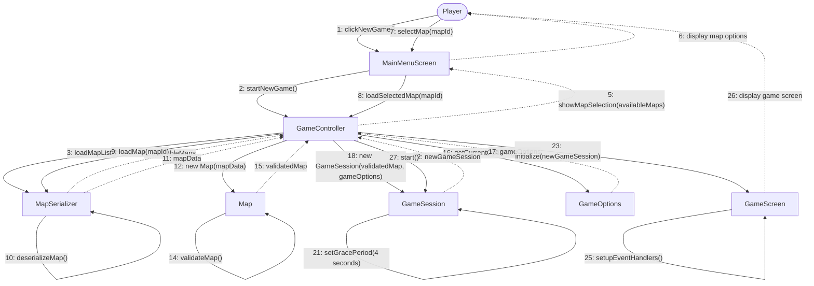

# Communication Diagram: Start New Game

```mermaid
graph TD
    Player([Player])
    MainMenuScreen[MainMenuScreen]
    GameController[GameController]
    MapSerializer[MapSerializer]
    Map[Map]
    GameSession[GameSession]
    GameOptions[GameOptions]
    GameScreen[GameScreen]

    Player -->|"1: clickNewGame()"| MainMenuScreen
    MainMenuScreen -->|"2: startNewGame()"| GameController
    GameController -->|"3: loadMapList()"| MapSerializer
    MapSerializer -.->|"4: availableMaps"| GameController
    GameController -.->|"5: showMapSelection(availableMaps)"| MainMenuScreen
    MainMenuScreen -.->|"6: display map options"| Player
    
    Player -->|"7: selectMap(mapId)"| MainMenuScreen
    MainMenuScreen -->|"8: loadSelectedMap(mapId)"| GameController
    GameController -->|"9: loadMap(mapId)"| MapSerializer
    MapSerializer -->|"10: deserializeMap()"| MapSerializer
    MapSerializer -.->|"11: mapData"| GameController
    
    GameController -->|"12: new Map(mapData)"| Map
    Map -->|"13: initializeGrid()"| Map
    Map -->|"14: validateMap()"| Map
    Map -.->|"15: validatedMap"| GameController
    
    GameController -->|"16: getCurrentOptions()"| GameOptions
    GameOptions -.->|"17: gameOptions"| GameController
    
    GameController -->|"18: new GameSession(validatedMap, gameOptions)"| GameSession
    GameSession -->|"19: initializePlayer()"| GameSession
    GameSession -->|"20: setupWaves()"| GameSession
    GameSession -->|"21: setGracePeriod(4 seconds)"| GameSession
    GameSession -.->|"22: newGameSession"| GameController
    
    GameController -->|"23: initialize(newGameSession)"| GameScreen
    GameScreen -->|"24: setupUI()"| GameScreen
    GameScreen -->|"25: setupEventHandlers()"| GameScreen
    GameScreen -.->|"26: display game screen"| Player
    
    GameController -->|"27: start()"| GameSession
``` 