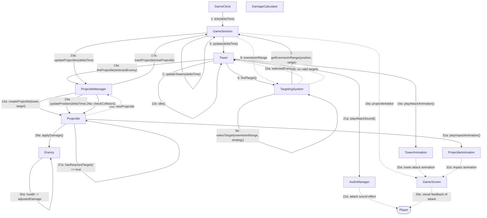

# Communication Diagram: Tower Attack

```mermaid
graph TD
    GameClock[GameClock]
    GameSession[GameSession]
    Tower[Tower]
    TargetingSystem[TargetingSystem]
    Enemy[Enemy]
    Projectile[Projectile]
    ProjectileManager[ProjectileManager]
    DamageCalculator[DamageCalculator]
    TowerAnimation[TowerAnimation]
    ProjectileAnimation[ProjectileAnimation]
    GameScreen[GameScreen]
    Player([Player])
    AudioManager[AudioManager]

    GameClock -->|"1: tick(deltaTime)"| GameSession
    GameSession -->|"2: updateTowers(deltaTime)"| GameSession
    GameSession -->|"3: update(deltaTime)"| Tower
    
    Tower -->|"4: updateAttackCooldown(deltaTime)"| Tower
    Tower -->|"5: canAttack() == true"| Tower
    Tower -->|"6: findTarget()"| TargetingSystem
    
    TargetingSystem -->|"7: getEnemiesInRange(position, range)"| GameSession
    GameSession -.->|"8: enemiesInRange"| TargetingSystem
    
    TargetingSystem -->|"9a: selectTarget(enemiesInRange, strategy)"| TargetingSystem
    TargetingSystem -.->|"10a: selectedEnemy"| Tower
    
    Tower -->|"11a: attack(selectedEnemy)"| Tower
    Tower -->|"12a: resetAttackCooldown()"| Tower
    
    Tower -->|"13a: fireProjectile(selectedEnemy)"| ProjectileManager
    ProjectileManager -->|"14a: createProjectile(tower, target)"| Projectile
    Projectile -->|"15a: initializeProperties(tower.damage, tower.effectType)"| Projectile
    Projectile -.->|"16a: newProjectile"| ProjectileManager
    
    ProjectileManager -->|"17a: trackProjectile(newProjectile)"| GameSession
    GameSession -.->|"18a: projectileAdded"| GameScreen
    
    Tower -->|"19a: playAttackAnimation()"| TowerAnimation
    TowerAnimation -.->|"20a: tower attack animation"| GameScreen
    
    Tower -->|"21a: playAttackSound()"| AudioManager
    AudioManager -.->|"22a: attack sound effect"| Player
    
    GameSession -->|"23a: updateProjectiles(deltaTime)"| ProjectileManager
    ProjectileManager -->|"24a: updatePosition(deltaTime)"| Projectile
    Projectile -->|"25a: moveTowardsTarget(deltaTime)"| Projectile
    
    ProjectileManager -->|"26a: checkCollision()"| Projectile
    Projectile -->|"27a: hasReachedTarget() == true"| Projectile
    Projectile -->|"28a: applyDamage()"| Enemy
    
    Enemy -->|"29a: receiveDamage(damage, effectType)"| Enemy
    Enemy -->|"30a: health -= adjustedDamage"| Enemy
    
    Projectile -->|"31a: playImpactAnimation()"| ProjectileAnimation
    ProjectileAnimation -.->|"32a: impact animation"| GameScreen
    
    GameScreen -.->|"33a: visual feedback of attack"| Player
    
    TargetingSystem -.->|"10b: no valid targets"| Tower
    Tower -->|"11b: idle()"| Tower
``` 