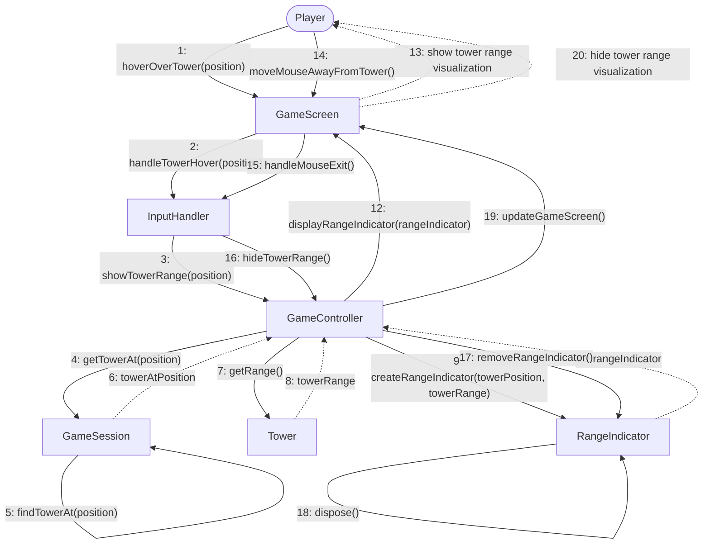

# Communication Diagram: View Tower Range

```mermaid
graph TD
    Player([Player])
    GameScreen[GameScreen]
    InputHandler[InputHandler]
    GameController[GameController]
    GameSession[GameSession]
    Tower[Tower]
    RangeIndicator[RangeIndicator]

    Player -->|"1: hoverOverTower(position)"| GameScreen
    GameScreen -->|"2: handleTowerHover(position)"| InputHandler
    InputHandler -->|"3: showTowerRange(position)"| GameController
    
    GameController -->|"4: getTowerAt(position)"| GameSession
    GameSession -->|"5: findTowerAt(position)"| GameSession
    GameSession -.->|"6: towerAtPosition"| GameController
    
    GameController -->|"7: getRange()"| Tower
    Tower -.->|"8: towerRange"| GameController
    
    GameController -->|"9: createRangeIndicator(towerPosition, towerRange)"| RangeIndicator
    RangeIndicator -->|"10: initializeGraphics()"| RangeIndicator
    RangeIndicator -.->|"11: rangeIndicator"| GameController
    
    GameController -->|"12: displayRangeIndicator(rangeIndicator)"| GameScreen
    GameScreen -.->|"13: show tower range visualization"| Player
    
    Player -->|"14: moveMouseAwayFromTower()"| GameScreen
    GameScreen -->|"15: handleMouseExit()"| InputHandler
    InputHandler -->|"16: hideTowerRange()"| GameController
    
    GameController -->|"17: removeRangeIndicator()"| RangeIndicator
    RangeIndicator -->|"18: dispose()"| RangeIndicator
    
    GameController -->|"19: updateGameScreen()"| GameScreen
    GameScreen -.->|"20: hide tower range visualization"| Player
``` 