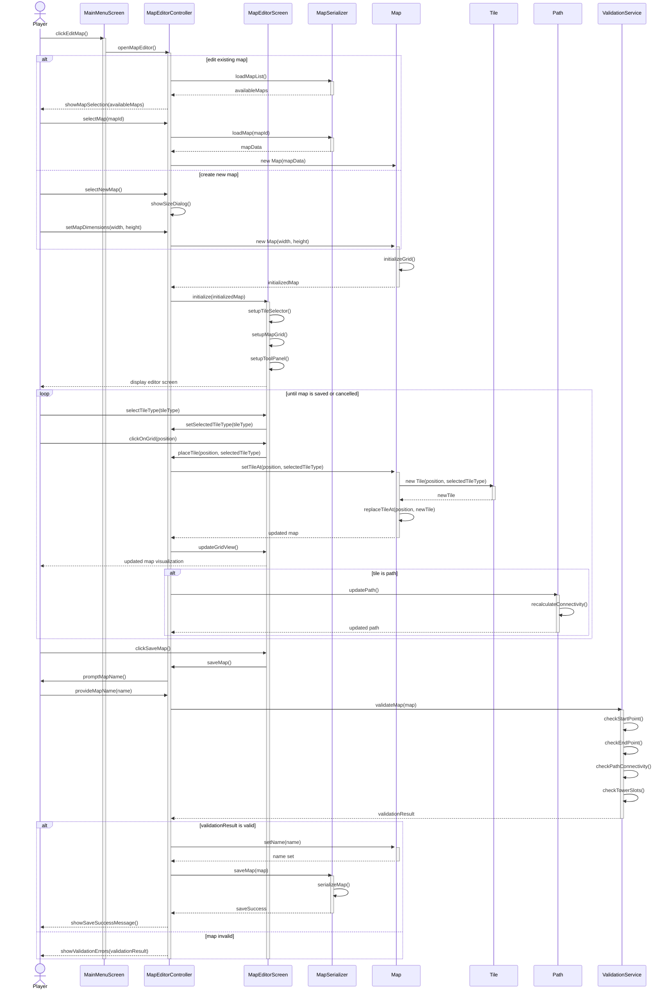

# Sequence Diagram: Edit Map

```mermaid
sequenceDiagram
    actor Player
    participant MainMenuScreen
    participant MapEditorController
    participant MapEditorScreen
    participant MapSerializer
    participant Map
    participant Tile
    participant Path
    participant ValidationService

    Player->>MainMenuScreen: clickEditMap()
    activate MainMenuScreen
    MainMenuScreen->>MapEditorController: openMapEditor()
    activate MapEditorController
    
    alt edit existing map
        MapEditorController->>MapSerializer: loadMapList()
        activate MapSerializer
        MapSerializer-->>MapEditorController: availableMaps
        deactivate MapSerializer
        MapEditorController-->>Player: showMapSelection(availableMaps)
        Player->>MapEditorController: selectMap(mapId)
        MapEditorController->>MapSerializer: loadMap(mapId)
        activate MapSerializer
        MapSerializer-->>MapEditorController: mapData
        deactivate MapSerializer
        MapEditorController->>Map: new Map(mapData)
        activate Map
    else create new map
        Player->>MapEditorController: selectNewMap()
        MapEditorController->>MapEditorController: showSizeDialog()
        Player->>MapEditorController: setMapDimensions(width, height)
        MapEditorController->>Map: new Map(width, height)
        activate Map
    end
    
    Map->>Map: initializeGrid()
    Map-->>MapEditorController: initializedMap
    deactivate Map
    
    MapEditorController->>MapEditorScreen: initialize(initializedMap)
    activate MapEditorScreen
    MapEditorScreen->>MapEditorScreen: setupTileSelector()
    MapEditorScreen->>MapEditorScreen: setupMapGrid()
    MapEditorScreen->>MapEditorScreen: setupToolPanel()
    MapEditorScreen-->>Player: display editor screen
    
    loop until map is saved or cancelled
        Player->>MapEditorScreen: selectTileType(tileType)
        MapEditorScreen->>MapEditorController: setSelectedTileType(tileType)
        
        Player->>MapEditorScreen: clickOnGrid(position)
        MapEditorScreen->>MapEditorController: placeTile(position, selectedTileType)
        MapEditorController->>Map: setTileAt(position, selectedTileType)
        activate Map
        Map->>Tile: new Tile(position, selectedTileType)
        activate Tile
        Tile-->>Map: newTile
        deactivate Tile
        Map->>Map: replaceTileAt(position, newTile)
        Map-->>MapEditorController: updated map
        deactivate Map
        
        MapEditorController->>MapEditorScreen: updateGridView()
        MapEditorScreen-->>Player: updated map visualization
        
        alt tile is path
            MapEditorController->>Path: updatePath()
            activate Path
            Path->>Path: recalculateConnectivity()
            Path-->>MapEditorController: updated path
            deactivate Path
        end
    end
    
    Player->>MapEditorScreen: clickSaveMap()
    MapEditorScreen->>MapEditorController: saveMap()
    
    MapEditorController->>Player: promptMapName()
    Player->>MapEditorController: provideMapName(name)
    
    MapEditorController->>ValidationService: validateMap(map)
    activate ValidationService
    ValidationService->>ValidationService: checkStartPoint()
    ValidationService->>ValidationService: checkEndPoint()
    ValidationService->>ValidationService: checkPathConnectivity()
    ValidationService->>ValidationService: checkTowerSlots()
    ValidationService-->>MapEditorController: validationResult
    deactivate ValidationService
    
    alt validationResult is valid
        MapEditorController->>Map: setName(name)
        activate Map
        Map-->>MapEditorController: name set
        deactivate Map
        MapEditorController->>MapSerializer: saveMap(map)
        activate MapSerializer
        MapSerializer->>MapSerializer: serializeMap()
        MapSerializer-->>MapEditorController: saveSuccess
        deactivate MapSerializer
        MapEditorController-->>Player: showSaveSuccessMessage()
    else map invalid
        MapEditorController-->>Player: showValidationErrors(validationResult)
    end
    deactivate MapEditorController
    deactivate MapEditorScreen
    deactivate MainMenuScreen
``` 
