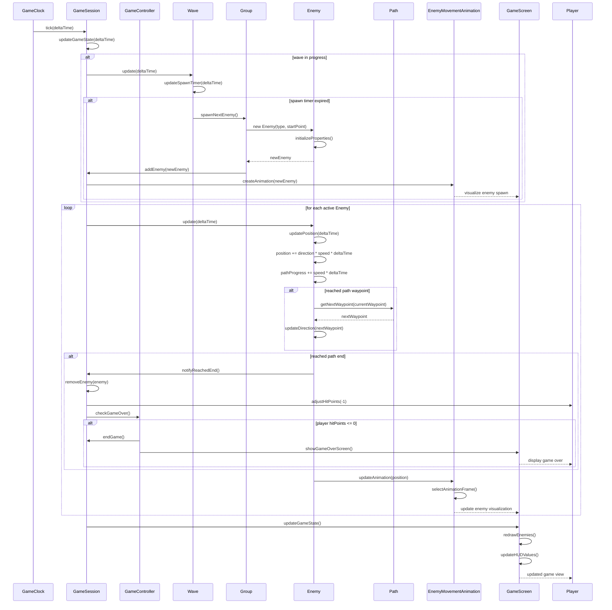

# Sequence Diagram: Enemy Movement

```mermaid
sequenceDiagram
    participant GameClock
    participant GameSession
    participant GameController
    participant Wave
    participant Group
    participant Enemy
    participant Path
    participant EnemyMovementAnimation
    participant GameScreen
    participant Player

    GameClock->>GameSession: tick(deltaTime)
    GameSession->>GameSession: updateGameState(deltaTime)
    
    alt wave in progress
        GameSession->>Wave: update(deltaTime)
        Wave->>Wave: updateSpawnTimer(deltaTime)
        
        alt spawn timer expired
            Wave->>Group: spawnNextEnemy()
            Group->>Enemy: new Enemy(type, startPoint)
            Enemy->>Enemy: initializeProperties()
            Enemy-->>Group: newEnemy
            Group->>GameSession: addEnemy(newEnemy)
            GameSession->>EnemyMovementAnimation: createAnimation(newEnemy)
            EnemyMovementAnimation-->>GameScreen: visualize enemy spawn
        end
    end
    
    loop for each active Enemy
        GameSession->>Enemy: update(deltaTime)
        Enemy->>Enemy: updatePosition(deltaTime)
        
        Enemy->>Enemy: position += direction * speed * deltaTime
        Enemy->>Enemy: pathProgress += speed * deltaTime
        
        alt reached path waypoint
            Enemy->>Path: getNextWaypoint(currentWaypoint)
            Path-->>Enemy: nextWaypoint
            Enemy->>Enemy: updateDirection(nextWaypoint)
        end
        
        alt reached path end
            Enemy->>GameSession: notifyReachedEnd()
            GameSession->>GameSession: removeEnemy(enemy)
            GameSession->>Player: adjustHitPoints(-1)
            
            GameSession->>GameController: checkGameOver()
            
            alt player hitPoints <= 0
                GameController->>GameSession: endGame()
                GameController->>GameScreen: showGameOverScreen()
                GameScreen-->>Player: display game over
            end
        end
        
        Enemy->>EnemyMovementAnimation: updateAnimation(position)
        EnemyMovementAnimation->>EnemyMovementAnimation: selectAnimationFrame()
        EnemyMovementAnimation-->>GameScreen: update enemy visualization
    end
    
    GameSession->>GameScreen: updateGameState()
    GameScreen->>GameScreen: redrawEnemies()
    GameScreen->>GameScreen: updateHUDValues()
    GameScreen-->>Player: updated game view
``` 