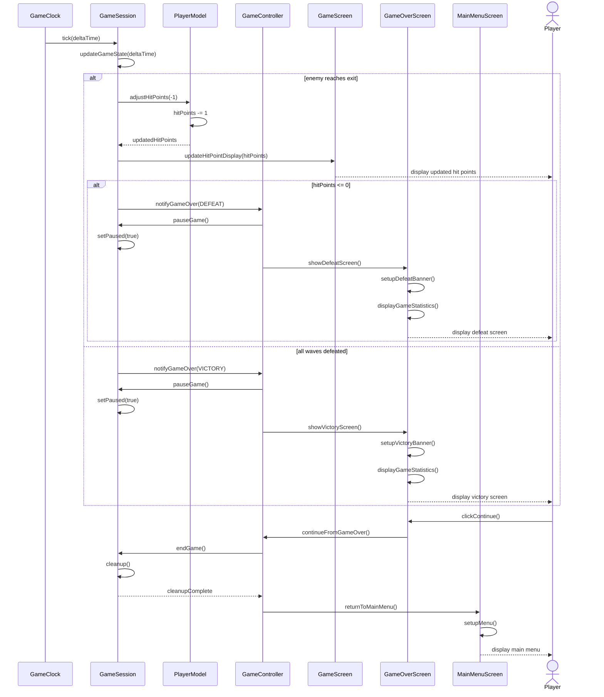

# Sequence Diagram: Game Over

```mermaid
sequenceDiagram
    participant GameClock
    participant GameSession
    participant PlayerModel
    participant GameController
    participant GameScreen
    participant GameOverScreen
    participant MainMenuScreen
    actor Player

    GameClock->>GameSession: tick(deltaTime)
    GameSession->>GameSession: updateGameState(deltaTime)
    
    alt enemy reaches exit
        GameSession->>PlayerModel: adjustHitPoints(-1)
        PlayerModel->>PlayerModel: hitPoints -= 1
        PlayerModel-->>GameSession: updatedHitPoints
        
        GameSession->>GameScreen: updateHitPointDisplay(hitPoints)
        GameScreen-->>Player: display updated hit points
        
        alt hitPoints <= 0
            GameSession->>GameController: notifyGameOver(DEFEAT)
            GameController->>GameSession: pauseGame()
            GameSession->>GameSession: setPaused(true)
            
            GameController->>GameOverScreen: showDefeatScreen()
            GameOverScreen->>GameOverScreen: setupDefeatBanner()
            GameOverScreen->>GameOverScreen: displayGameStatistics()
            GameOverScreen-->>Player: display defeat screen
        end
    else all waves defeated
        GameSession->>GameController: notifyGameOver(VICTORY)
        GameController->>GameSession: pauseGame()
        GameSession->>GameSession: setPaused(true)
        
        GameController->>GameOverScreen: showVictoryScreen()
        GameOverScreen->>GameOverScreen: setupVictoryBanner()
        GameOverScreen->>GameOverScreen: displayGameStatistics()
        GameOverScreen-->>Player: display victory screen
    end
    
    Player->>GameOverScreen: clickContinue()
    GameOverScreen->>GameController: continueFromGameOver()
    
    GameController->>GameSession: endGame()
    GameSession->>GameSession: cleanup()
    GameSession-->>GameController: cleanupComplete
    
    GameController->>MainMenuScreen: returnToMainMenu()
    MainMenuScreen->>MainMenuScreen: setupMenu()
    MainMenuScreen-->>Player: display main menu
``` 