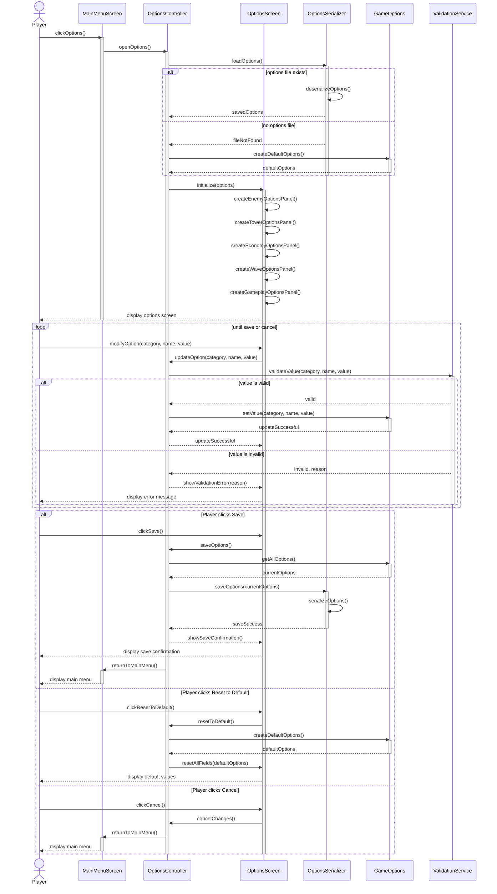

# Sequence Diagram: Open Options

```mermaid
sequenceDiagram
    actor Player
    participant MainMenuScreen
    participant OptionsController
    participant OptionsScreen
    participant OptionsSerializer
    participant GameOptions
    participant ValidationService

    Player->>MainMenuScreen: clickOptions()
    activate MainMenuScreen
    MainMenuScreen->>OptionsController: openOptions()
    activate OptionsController
    
    OptionsController->>OptionsSerializer: loadOptions()
    activate OptionsSerializer
    alt options file exists
        OptionsSerializer->>OptionsSerializer: deserializeOptions()
        OptionsSerializer-->>OptionsController: savedOptions
    else no options file
        OptionsSerializer-->>OptionsController: fileNotFound
        OptionsController->>GameOptions: createDefaultOptions()
        activate GameOptions
        GameOptions-->>OptionsController: defaultOptions
        deactivate GameOptions
    end
    deactivate OptionsSerializer
    
    OptionsController->>OptionsScreen: initialize(options)
    activate OptionsScreen
    OptionsScreen->>OptionsScreen: createEnemyOptionsPanel()
    OptionsScreen->>OptionsScreen: createTowerOptionsPanel()
    OptionsScreen->>OptionsScreen: createEconomyOptionsPanel()
    OptionsScreen->>OptionsScreen: createWaveOptionsPanel()
    OptionsScreen->>OptionsScreen: createGameplayOptionsPanel()
    OptionsScreen-->>Player: display options screen
    deactivate MainMenuScreen
    
    loop until save or cancel
        Player->>OptionsScreen: modifyOption(category, name, value)
        OptionsScreen->>OptionsController: updateOption(category, name, value)
        OptionsController->>ValidationService: validateValue(category, name, value)
        activate ValidationService
        
        alt value is valid
            ValidationService-->>OptionsController: valid
            OptionsController->>GameOptions: setValue(category, name, value)
            activate GameOptions
            GameOptions-->>OptionsController: updateSuccessful
            deactivate GameOptions
            OptionsController-->>OptionsScreen: updateSuccessful
        else value is invalid
            ValidationService-->>OptionsController: invalid, reason
            OptionsController-->>OptionsScreen: showValidationError(reason)
            OptionsScreen-->>Player: display error message
        end
        deactivate ValidationService
    end
    
    alt Player clicks Save
        Player->>OptionsScreen: clickSave()
        OptionsScreen->>OptionsController: saveOptions()
        OptionsController->>GameOptions: getAllOptions()
        activate GameOptions
        GameOptions-->>OptionsController: currentOptions
        deactivate GameOptions
        OptionsController->>OptionsSerializer: saveOptions(currentOptions)
        activate OptionsSerializer
        OptionsSerializer->>OptionsSerializer: serializeOptions()
        OptionsSerializer-->>OptionsController: saveSuccess
        deactivate OptionsSerializer
        OptionsController-->>OptionsScreen: showSaveConfirmation()
        OptionsScreen-->>Player: display save confirmation
        OptionsController->>MainMenuScreen: returnToMainMenu()
        activate MainMenuScreen
        MainMenuScreen-->>Player: display main menu
        deactivate MainMenuScreen
    else Player clicks Reset to Default
        Player->>OptionsScreen: clickResetToDefault()
        OptionsScreen->>OptionsController: resetToDefault()
        OptionsController->>GameOptions: createDefaultOptions()
        activate GameOptions
        GameOptions-->>OptionsController: defaultOptions
        deactivate GameOptions
        OptionsController->>OptionsScreen: resetAllFields(defaultOptions)
        OptionsScreen-->>Player: display default values
    else Player clicks Cancel
        Player->>OptionsScreen: clickCancel()
        OptionsScreen->>OptionsController: cancelChanges()
        OptionsController->>MainMenuScreen: returnToMainMenu()
        activate MainMenuScreen
        MainMenuScreen-->>Player: display main menu
        deactivate MainMenuScreen
    end
    deactivate OptionsScreen
    deactivate OptionsController
``` 