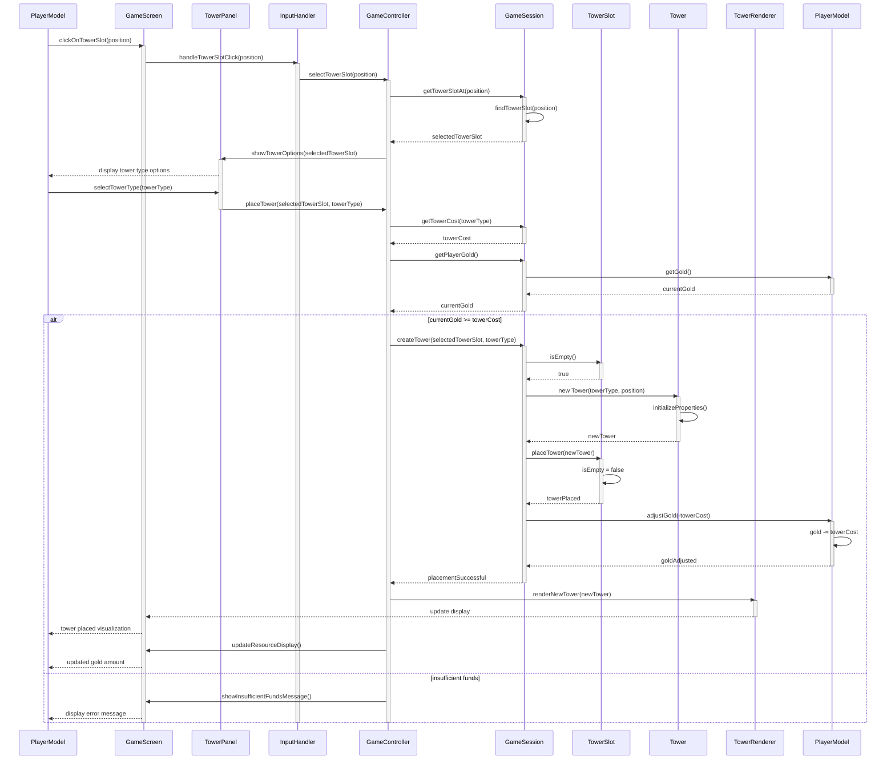

# Sequence Diagram: Place Tower

```mermaid
sequenceDiagram
    actor Player
    participant GameScreen
    participant TowerPanel
    participant InputHandler
    participant GameController
    participant GameSession
    participant Player as PlayerModel
    participant TowerSlot
    participant Tower
    participant TowerRenderer

    Player->>GameScreen: clickOnTowerSlot(position)
    activate GameScreen
    GameScreen->>InputHandler: handleTowerSlotClick(position)
    activate InputHandler
    InputHandler->>GameController: selectTowerSlot(position)
    activate GameController
    GameController->>GameSession: getTowerSlotAt(position)
    activate GameSession
    GameSession->>GameSession: findTowerSlot(position)
    GameSession-->>GameController: selectedTowerSlot
    deactivate GameSession
    
    GameController->>TowerPanel: showTowerOptions(selectedTowerSlot)
    activate TowerPanel
    TowerPanel-->>Player: display tower type options
    
    Player->>TowerPanel: selectTowerType(towerType)
    TowerPanel->>GameController: placeTower(selectedTowerSlot, towerType)
    deactivate TowerPanel
    
    GameController->>GameSession: getTowerCost(towerType)
    activate GameSession
    GameSession-->>GameController: towerCost
    deactivate GameSession
    
    GameController->>GameSession: getPlayerGold()
    activate GameSession
    GameSession->>PlayerModel: getGold()
    activate PlayerModel
    PlayerModel-->>GameSession: currentGold
    deactivate PlayerModel
    GameSession-->>GameController: currentGold
    deactivate GameSession
    
    alt currentGold >= towerCost
        GameController->>GameSession: createTower(selectedTowerSlot, towerType)
        activate GameSession
        GameSession->>TowerSlot: isEmpty()
        activate TowerSlot
        TowerSlot-->>GameSession: true
        deactivate TowerSlot
        
        GameSession->>Tower: new Tower(towerType, position)
        activate Tower
        Tower->>Tower: initializeProperties()
        Tower-->>GameSession: newTower
        deactivate Tower
        
        GameSession->>TowerSlot: placeTower(newTower)
        activate TowerSlot
        TowerSlot->>TowerSlot: isEmpty = false
        TowerSlot-->>GameSession: towerPlaced
        deactivate TowerSlot
        
        GameSession->>PlayerModel: adjustGold(-towerCost)
        activate PlayerModel
        PlayerModel->>PlayerModel: gold -= towerCost
        PlayerModel-->>GameSession: goldAdjusted
        deactivate PlayerModel
        
        GameSession-->>GameController: placementSuccessful
        deactivate GameSession
        GameController->>TowerRenderer: renderNewTower(newTower)
        activate TowerRenderer
        TowerRenderer-->>GameScreen: update display
        deactivate TowerRenderer
        GameScreen-->>Player: tower placed visualization
        
        GameController->>GameScreen: updateResourceDisplay()
        GameScreen-->>Player: updated gold amount
    else insufficient funds
        GameController->>GameScreen: showInsufficientFundsMessage()
        GameScreen-->>Player: display error message
    end
    deactivate GameController
    deactivate InputHandler
    deactivate GameScreen
``` 