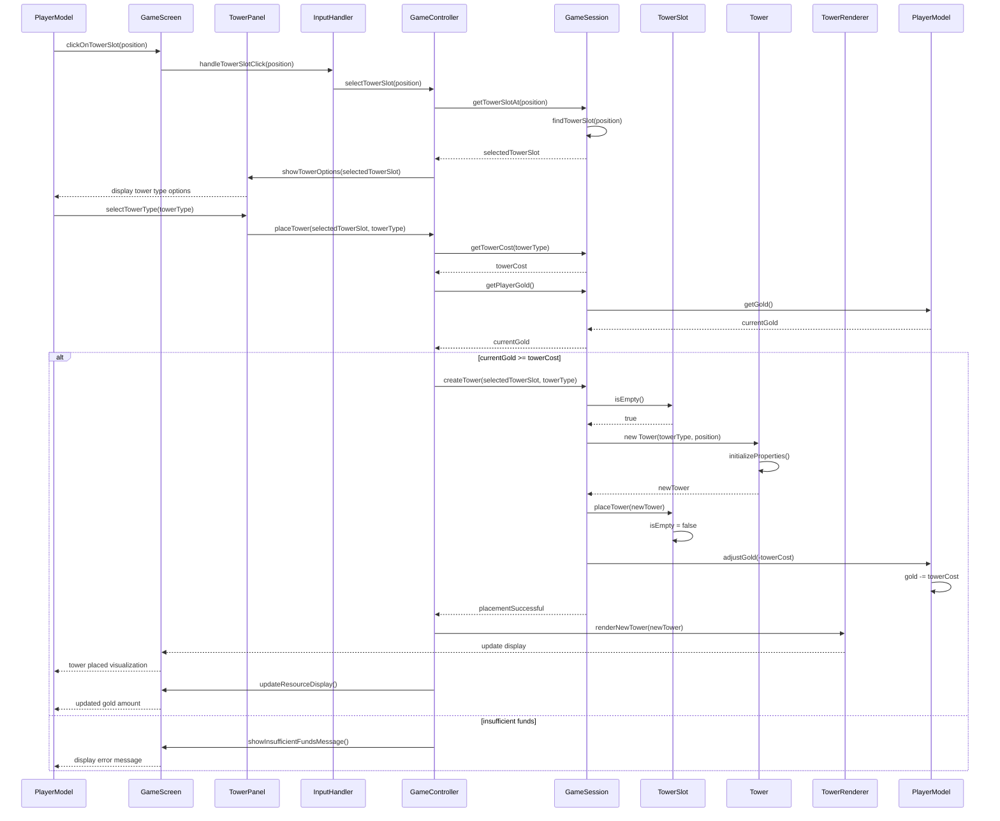

# Sequence Diagram: Place Tower

```mermaid
sequenceDiagram
    actor Player
    participant GameScreen
    participant TowerPanel
    participant InputHandler
    participant GameController
    participant GameSession
    participant Player as PlayerModel
    participant TowerSlot
    participant Tower
    participant TowerRenderer

    Player->>GameScreen: clickOnTowerSlot(position)
    GameScreen->>InputHandler: handleTowerSlotClick(position)
    InputHandler->>GameController: selectTowerSlot(position)
    GameController->>GameSession: getTowerSlotAt(position)
    GameSession->>GameSession: findTowerSlot(position)
    GameSession-->>GameController: selectedTowerSlot
    
    GameController->>TowerPanel: showTowerOptions(selectedTowerSlot)
    TowerPanel-->>Player: display tower type options
    
    Player->>TowerPanel: selectTowerType(towerType)
    TowerPanel->>GameController: placeTower(selectedTowerSlot, towerType)
    
    GameController->>GameSession: getTowerCost(towerType)
    GameSession-->>GameController: towerCost
    
    GameController->>GameSession: getPlayerGold()
    GameSession->>PlayerModel: getGold()
    PlayerModel-->>GameSession: currentGold
    GameSession-->>GameController: currentGold
    
    alt currentGold >= towerCost
        GameController->>GameSession: createTower(selectedTowerSlot, towerType)
        GameSession->>TowerSlot: isEmpty()
        TowerSlot-->>GameSession: true
        
        GameSession->>Tower: new Tower(towerType, position)
        Tower->>Tower: initializeProperties()
        Tower-->>GameSession: newTower
        
        GameSession->>TowerSlot: placeTower(newTower)
        TowerSlot->>TowerSlot: isEmpty = false
        
        GameSession->>PlayerModel: adjustGold(-towerCost)
        PlayerModel->>PlayerModel: gold -= towerCost
        
        GameSession-->>GameController: placementSuccessful
        GameController->>TowerRenderer: renderNewTower(newTower)
        TowerRenderer-->>GameScreen: update display
        GameScreen-->>Player: tower placed visualization
        
        GameController->>GameScreen: updateResourceDisplay()
        GameScreen-->>Player: updated gold amount
    else insufficient funds
        GameController->>GameScreen: showInsufficientFundsMessage()
        GameScreen-->>Player: display error message
    end
``` 