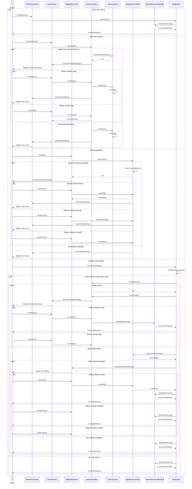

# Sequence Diagram: Quit Game

```mermaid
sequenceDiagram
    actor Player
    participant MainMenuScreen
    participant GameScreen
    participant MapEditorScreen
    participant GameController
    participant GameSession
    participant MapEditorController
    participant SystemResourceManager
    participant Application

    alt from main menu
        Player->>MainMenuScreen: clickQuitGame()
        MainMenuScreen->>Application: requestExit()
        Application->>SystemResourceManager: releaseResources()
        SystemResourceManager-->>Application: resourcesReleased
        Application-->>Player: closeApplication()
    else from active game
        Player->>GameScreen: clickQuitGame()
        GameScreen->>GameController: requestQuit()
        
        alt game has unsaved progress
            GameController->>GameSession: hasUnsavedProgress()
            GameSession-->>GameController: true
            GameController->>GameScreen: showConfirmationDialog()
            GameScreen-->>Player: display confirmation dialog
            
            alt Player confirms quit
                Player->>GameScreen: confirmQuit()
                GameScreen->>GameController: confirmQuit()
                GameController->>GameSession: endGame()
                GameSession->>GameSession: cleanup()
                GameController->>MainMenuScreen: returnToMainMenu()
                MainMenuScreen-->>Player: display main menu
            else Player cancels quit
                Player->>GameScreen: cancelQuit()
                GameScreen->>GameController: cancelQuit()
                GameController-->>GameScreen: resumeGame()
            end
        else no unsaved progress
            GameController->>GameSession: endGame()
            GameSession->>GameSession: cleanup()
            GameController->>MainMenuScreen: returnToMainMenu()
            MainMenuScreen-->>Player: display main menu
        end
    else from map editor
        Player->>MapEditorScreen: clickQuit()
        MapEditorScreen->>MapEditorController: requestQuit()
        
        alt map has unsaved changes
            MapEditorController->>MapEditorController: hasUnsavedChanges()
            MapEditorController-->>MapEditorScreen: true
            MapEditorScreen->>Player: showSaveChangesDialog()
            
            alt Player chooses Save
                Player->>MapEditorScreen: selectSave()
                MapEditorScreen->>MapEditorController: saveMap()
                MapEditorController-->>MapEditorScreen: mapSaved
                MapEditorController->>MainMenuScreen: returnToMainMenu()
                MainMenuScreen-->>Player: display main menu
            else Player chooses Discard
                Player->>MapEditorScreen: selectDiscard()
                MapEditorScreen->>MapEditorController: discardChanges()
                MapEditorController->>MainMenuScreen: returnToMainMenu()
                MainMenuScreen-->>Player: display main menu
            else Player chooses Cancel
                Player->>MapEditorScreen: selectCancel()
                MapEditorScreen->>MapEditorController: cancelQuit()
            end
        else no unsaved changes
            MapEditorController->>MainMenuScreen: returnToMainMenu()
            MainMenuScreen-->>Player: display main menu
        end
    else window close button
        Player->>Application: clickCloseWindow()
        Application->>Application: handleWindowClosing()
        
        alt active game or map editor open
            Application->>GameController: isGameActive()
            alt game active
                GameController-->>Application: true
                Application->>GameController: requestQuit()
                GameController->>GameScreen: showConfirmationDialog()
                GameScreen-->>Player: display confirmation dialog
                
                alt Player confirms quit
                    Player->>GameScreen: confirmQuit()
                    GameScreen->>GameController: confirmQuit()
                    GameController->>SystemResourceManager: releaseResources()
                    SystemResourceManager-->>Application: resourcesReleased
                    Application-->>Player: closeApplication()
                else Player cancels quit
                    Player->>GameScreen: cancelQuit()
                    GameScreen->>GameController: cancelQuit()
                end
            else map editor active
                Application->>MapEditorController: hasUnsavedChanges()
                MapEditorController-->>Application: hasChanges
                
                alt has unsaved changes
                    Application->>MapEditorScreen: showSaveChangesDialog()
                    MapEditorScreen-->>Player: display save dialog
                    
                    alt Player chooses Save
                        Player->>MapEditorScreen: selectSave()
                        MapEditorScreen->>MapEditorController: saveMap()
                        MapEditorController-->>Application: mapSaved
                        Application->>SystemResourceManager: releaseResources()
                        SystemResourceManager-->>Application: resourcesReleased
                        Application-->>Player: closeApplication()
                    else Player chooses Discard
                        Player->>MapEditorScreen: selectDiscard()
                        Application->>SystemResourceManager: releaseResources()
                        SystemResourceManager-->>Application: resourcesReleased
                        Application-->>Player: closeApplication()
                    else Player chooses Cancel
                        Player->>MapEditorScreen: selectCancel()
                    end
                else no unsaved changes
                    Application->>SystemResourceManager: releaseResources()
                    SystemResourceManager-->>Application: resourcesReleased
                    Application-->>Player: closeApplication()
                end
            end
        else in main menu
            Application->>SystemResourceManager: releaseResources()
            SystemResourceManager-->>Application: resourcesReleased
            Application-->>Player: closeApplication()
        end
    end
``` 