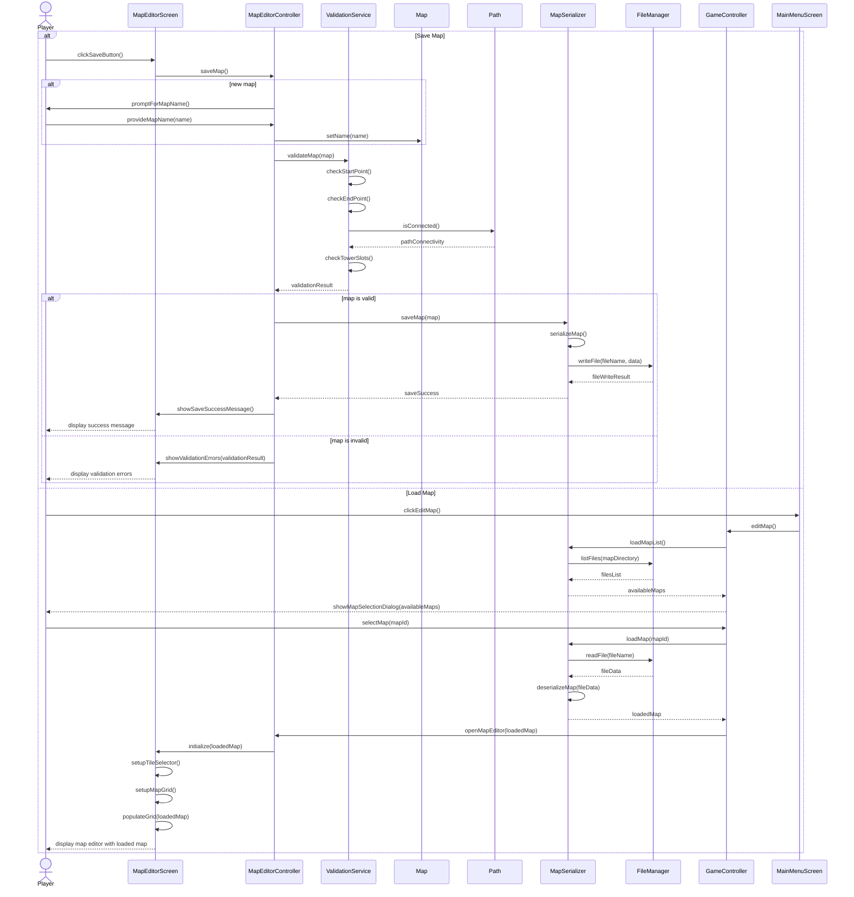

# Sequence Diagram: Save and Load Map

```mermaid
sequenceDiagram
    actor Player
    participant MapEditorScreen
    participant MapEditorController
    participant ValidationService
    participant Map
    participant Path
    participant MapSerializer
    participant FileManager
    participant GameController
    participant MainMenuScreen

    alt Save Map
        Player->>MapEditorScreen: clickSaveButton()
        MapEditorScreen->>MapEditorController: saveMap()
        
        alt new map
            MapEditorController->>Player: promptForMapName()
            Player->>MapEditorController: provideMapName(name)
            MapEditorController->>Map: setName(name)
        end
        
        MapEditorController->>ValidationService: validateMap(map)
        ValidationService->>ValidationService: checkStartPoint()
        ValidationService->>ValidationService: checkEndPoint()
        ValidationService->>Path: isConnected()
        Path-->>ValidationService: pathConnectivity
        ValidationService->>ValidationService: checkTowerSlots()
        ValidationService-->>MapEditorController: validationResult
        
        alt map is valid
            MapEditorController->>MapSerializer: saveMap(map)
            MapSerializer->>MapSerializer: serializeMap()
            MapSerializer->>FileManager: writeFile(fileName, data)
            FileManager-->>MapSerializer: fileWriteResult
            MapSerializer-->>MapEditorController: saveSuccess
            MapEditorController->>MapEditorScreen: showSaveSuccessMessage()
            MapEditorScreen-->>Player: display success message
        else map is invalid
            MapEditorController->>MapEditorScreen: showValidationErrors(validationResult)
            MapEditorScreen-->>Player: display validation errors
        end
    else Load Map
        Player->>MainMenuScreen: clickEditMap()
        MainMenuScreen->>GameController: editMap()
        GameController->>MapSerializer: loadMapList()
        MapSerializer->>FileManager: listFiles(mapDirectory)
        FileManager-->>MapSerializer: filesList
        MapSerializer-->>GameController: availableMaps
        GameController-->>Player: showMapSelectionDialog(availableMaps)
        
        Player->>GameController: selectMap(mapId)
        GameController->>MapSerializer: loadMap(mapId)
        MapSerializer->>FileManager: readFile(fileName)
        FileManager-->>MapSerializer: fileData
        MapSerializer->>MapSerializer: deserializeMap(fileData)
        MapSerializer-->>GameController: loadedMap
        
        GameController->>MapEditorController: openMapEditor(loadedMap)
        MapEditorController->>MapEditorScreen: initialize(loadedMap)
        MapEditorScreen->>MapEditorScreen: setupTileSelector()
        MapEditorScreen->>MapEditorScreen: setupMapGrid()
        MapEditorScreen->>MapEditorScreen: populateGrid(loadedMap)
        MapEditorScreen-->>Player: display map editor with loaded map
    end
``` 