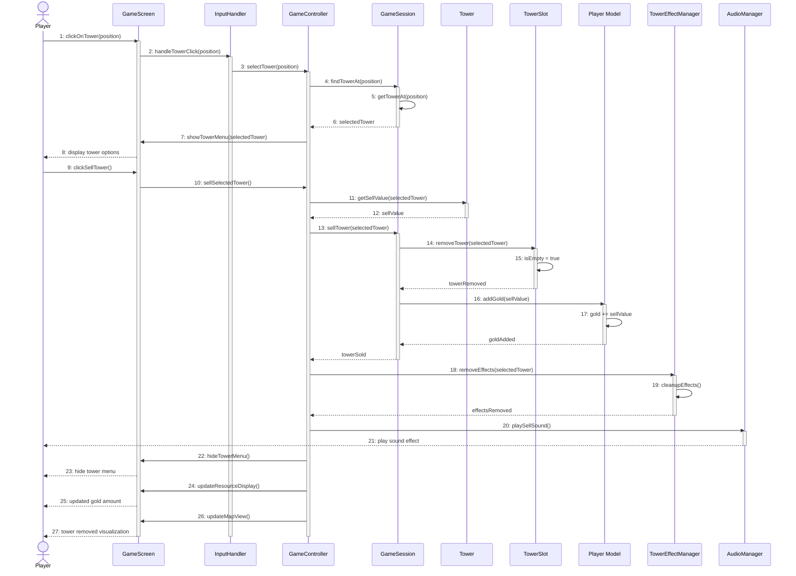

# Sequence Diagram: Sell Tower

```mermaid
sequenceDiagram
    actor Player
    participant GameScreen
    participant InputHandler
    participant GameController
    participant GameSession
    participant Tower
    participant TowerSlot
    participant PlayerModel as Player Model
    participant TowerEffectManager
    participant AudioManager

    Player->>GameScreen: 1: clickOnTower(position)
    activate GameScreen
    GameScreen->>InputHandler: 2: handleTowerClick(position)
    activate InputHandler
    InputHandler->>GameController: 3: selectTower(position)
    activate GameController
    
    GameController->>GameSession: 4: findTowerAt(position)
    activate GameSession
    GameSession->>GameSession: 5: getTowerAt(position)
    GameSession-->>GameController: 6: selectedTower
    deactivate GameSession
    
    GameController->>GameScreen: 7: showTowerMenu(selectedTower)
    GameScreen-->>Player: 8: display tower options
    
    Player->>GameScreen: 9: clickSellTower()
    GameScreen->>GameController: 10: sellSelectedTower()
    
    GameController->>Tower: 11: getSellValue(selectedTower)
    activate Tower
    Tower-->>GameController: 12: sellValue
    deactivate Tower
    
    GameController->>GameSession: 13: sellTower(selectedTower)
    activate GameSession
    GameSession->>TowerSlot: 14: removeTower(selectedTower)
    activate TowerSlot
    TowerSlot->>TowerSlot: 15: isEmpty = true
    TowerSlot-->>GameSession: towerRemoved
    deactivate TowerSlot
    
    GameSession->>PlayerModel: 16: addGold(sellValue)
    activate PlayerModel
    PlayerModel->>PlayerModel: 17: gold += sellValue
    PlayerModel-->>GameSession: goldAdded
    deactivate PlayerModel
    GameSession-->>GameController: towerSold
    deactivate GameSession
    
    GameController->>TowerEffectManager: 18: removeEffects(selectedTower)
    activate TowerEffectManager
    TowerEffectManager->>TowerEffectManager: 19: cleanupEffects()
    TowerEffectManager-->>GameController: effectsRemoved
    deactivate TowerEffectManager
    
    GameController->>AudioManager: 20: playSellSound()
    activate AudioManager
    AudioManager-->>Player: 21: play sound effect
    deactivate AudioManager
    
    GameController->>GameScreen: 22: hideTowerMenu()
    GameScreen-->>Player: 23: hide tower menu
    
    GameController->>GameScreen: 24: updateResourceDisplay()
    GameScreen-->>Player: 25: updated gold amount
    
    GameController->>GameScreen: 26: updateMapView()
    GameScreen-->>Player: 27: tower removed visualization
    deactivate GameController
    deactivate InputHandler
    deactivate GameScreen
``` 