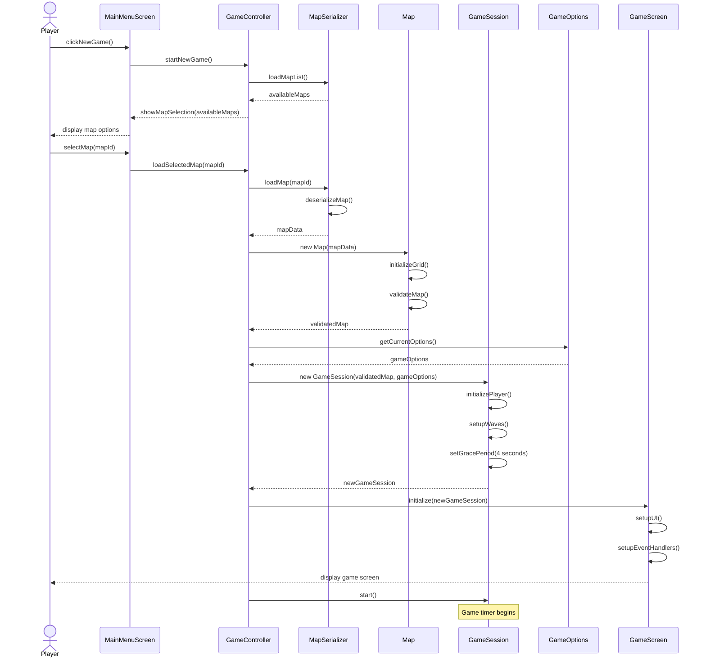

# Sequence Diagram: Start New Game

```mermaid
sequenceDiagram
    actor Player
    participant MainMenuScreen
    participant GameController
    participant MapSerializer
    participant Map
    participant GameSession
    participant GameOptions
    participant GameScreen

    Player->>MainMenuScreen: clickNewGame()
    MainMenuScreen->>GameController: startNewGame()
    GameController->>MapSerializer: loadMapList()
    MapSerializer-->>GameController: availableMaps
    GameController-->>MainMenuScreen: showMapSelection(availableMaps)
    MainMenuScreen-->>Player: display map options
    
    Player->>MainMenuScreen: selectMap(mapId)
    MainMenuScreen->>GameController: loadSelectedMap(mapId)
    GameController->>MapSerializer: loadMap(mapId)
    MapSerializer->>MapSerializer: deserializeMap()
    MapSerializer-->>GameController: mapData
    
    GameController->>Map: new Map(mapData)
    Map->>Map: initializeGrid()
    Map->>Map: validateMap()
    Map-->>GameController: validatedMap
    
    GameController->>GameOptions: getCurrentOptions()
    GameOptions-->>GameController: gameOptions
    
    GameController->>GameSession: new GameSession(validatedMap, gameOptions)
    GameSession->>GameSession: initializePlayer()
    GameSession->>GameSession: setupWaves()
    GameSession->>GameSession: setGracePeriod(4 seconds)
    GameSession-->>GameController: newGameSession
    
    GameController->>GameScreen: initialize(newGameSession)
    GameScreen->>GameScreen: setupUI()
    GameScreen->>GameScreen: setupEventHandlers()
    GameScreen-->>Player: display game screen
    
    GameController->>GameSession: start()
    note over GameSession: Game timer begins
``` 