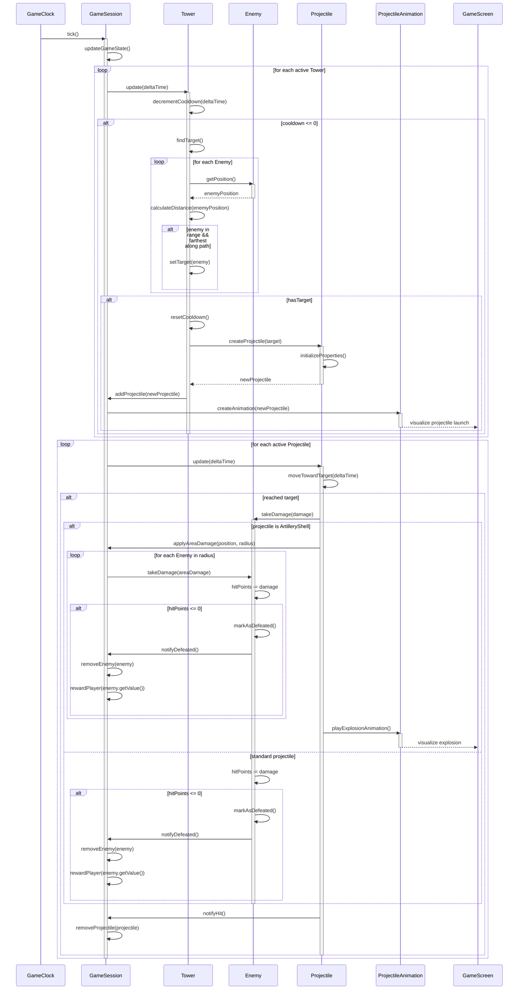

# Sequence Diagram: Tower Attack

```mermaid
sequenceDiagram
    participant GameClock
    participant GameSession
    participant Tower
    participant Enemy
    participant Projectile
    participant ProjectileAnimation
    participant GameScreen

    GameClock->>GameSession: tick()
    activate GameSession
    GameSession->>GameSession: updateGameState()
    
    loop for each active Tower
        GameSession->>Tower: update(deltaTime)
        activate Tower
        Tower->>Tower: decrementCooldown(deltaTime)
        
        alt cooldown <= 0
            Tower->>Tower: findTarget()
            
            loop for each Enemy
                Tower->>Enemy: getPosition()
                activate Enemy
                Enemy-->>Tower: enemyPosition
                deactivate Enemy
                Tower->>Tower: calculateDistance(enemyPosition)
                
                alt enemy in range && farthest along path
                    Tower->>Tower: setTarget(enemy)
                end
            end
            
            alt hasTarget
                Tower->>Tower: resetCooldown()
                Tower->>Projectile: createProjectile(target)
                activate Projectile
                Projectile->>Projectile: initializeProperties()
                Projectile-->>Tower: newProjectile
                deactivate Projectile
                
                Tower->>GameSession: addProjectile(newProjectile)
                GameSession->>ProjectileAnimation: createAnimation(newProjectile)
                activate ProjectileAnimation
                ProjectileAnimation-->>GameScreen: visualize projectile launch
                deactivate ProjectileAnimation
            end
        end
        deactivate Tower
    end
    
    loop for each active Projectile
        GameSession->>Projectile: update(deltaTime)
        activate Projectile
        Projectile->>Projectile: moveTowardTarget(deltaTime)
        
        alt reached target
            Projectile->>Enemy: takeDamage(damage)
            activate Enemy
            
            alt projectile is ArtilleryShell
                Projectile->>GameSession: applyAreaDamage(position, radius)
                
                loop for each Enemy in radius
                    GameSession->>Enemy: takeDamage(areaDamage)
                    Enemy->>Enemy: hitPoints -= damage
                    
                    alt hitPoints <= 0
                        Enemy->>Enemy: markAsDefeated()
                        Enemy->>GameSession: notifyDefeated()
                        GameSession->>GameSession: removeEnemy(enemy)
                        GameSession->>GameSession: rewardPlayer(enemy.getValue())
                    end
                end
                
                Projectile->>ProjectileAnimation: playExplosionAnimation()
                activate ProjectileAnimation
                ProjectileAnimation-->>GameScreen: visualize explosion
                deactivate ProjectileAnimation
            else standard projectile
                Enemy->>Enemy: hitPoints -= damage
                
                alt hitPoints <= 0
                    Enemy->>Enemy: markAsDefeated()
                    Enemy->>GameSession: notifyDefeated()
                    GameSession->>GameSession: removeEnemy(enemy)
                    GameSession->>GameSession: rewardPlayer(enemy.getValue())
                end
            end
            deactivate Enemy
            
            Projectile->>GameSession: notifyHit()
            GameSession->>GameSession: removeProjectile(projectile)
        end
        deactivate Projectile
    end
    deactivate GameSession
``` 