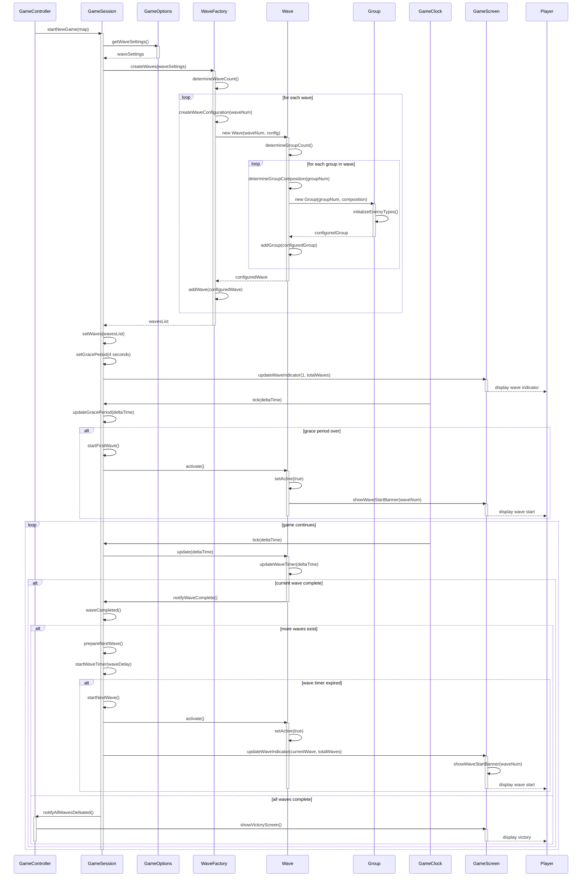

# Sequence Diagram: Wave Generation

```mermaid
sequenceDiagram
    participant GameController
    participant GameSession
    participant GameOptions
    participant WaveFactory
    participant Wave
    participant Group
    participant GameClock
    participant GameScreen
    participant Player

    GameController->>GameSession: startNewGame(map)
    activate GameSession
    GameSession->>GameOptions: getWaveSettings()
    activate GameOptions
    GameOptions-->>GameSession: waveSettings
    deactivate GameOptions
    
    GameSession->>WaveFactory: createWaves(waveSettings)
    activate WaveFactory
    WaveFactory->>WaveFactory: determineWaveCount()
    
    loop for each wave
        WaveFactory->>WaveFactory: createWaveConfiguration(waveNum)
        WaveFactory->>Wave: new Wave(waveNum, config)
        activate Wave
        
        Wave->>Wave: determineGroupCount()
        
        loop for each group in wave
            Wave->>Wave: determineGroupComposition(groupNum)
            Wave->>Group: new Group(groupNum, composition)
            activate Group
            Group->>Group: initializeEnemyTypes()
            Group-->>Wave: configuredGroup
            deactivate Group
            Wave->>Wave: addGroup(configuredGroup)
        end
        
        Wave-->>WaveFactory: configuredWave
        deactivate Wave
        WaveFactory->>WaveFactory: addWave(configuredWave)
    end
    
    WaveFactory-->>GameSession: wavesList
    deactivate WaveFactory
    GameSession->>GameSession: setWaves(wavesList)
    GameSession->>GameSession: setGracePeriod(4 seconds)
    
    GameSession->>GameScreen: updateWaveIndicator(1, totalWaves)
    activate GameScreen
    GameScreen-->>Player: display wave indicator
    deactivate GameScreen
    
    GameClock->>GameSession: tick(deltaTime)
    GameSession->>GameSession: updateGracePeriod(deltaTime)
    
    alt grace period over
        GameSession->>GameSession: startFirstWave()
        GameSession->>Wave: activate()
        activate Wave
        Wave->>Wave: setActive(true)
        Wave->>GameScreen: showWaveStartBanner(waveNum)
        activate GameScreen
        GameScreen-->>Player: display wave start
        deactivate GameScreen
        deactivate Wave
    end
    
    loop game continues
        GameClock->>GameSession: tick(deltaTime)
        GameSession->>Wave: update(deltaTime)
        activate Wave
        Wave->>Wave: updateWaveTimer(deltaTime)
        
        alt current wave complete
            Wave->>GameSession: notifyWaveComplete()
            deactivate Wave
            GameSession->>GameSession: waveCompleted()
            
            alt more waves exist
                GameSession->>GameSession: prepareNextWave()
                GameSession->>GameSession: startWaveTimer(waveDelay)
                
                alt wave timer expired
                    GameSession->>GameSession: startNextWave()
                    GameSession->>Wave: activate()
                    activate Wave
                    Wave->>Wave: setActive(true)
                    
                    GameSession->>GameScreen: updateWaveIndicator(currentWave, totalWaves)
                    activate GameScreen
                    GameScreen->>GameScreen: showWaveStartBanner(waveNum)
                    GameScreen-->>Player: display wave start
                    deactivate GameScreen
                    deactivate Wave
                end
            else all waves complete
                GameSession->>GameController: notifyAllWavesDefeated()
                activate GameController
                GameController->>GameScreen: showVictoryScreen()
                activate GameScreen
                GameScreen-->>Player: display victory
                deactivate GameScreen
                deactivate GameController
            end
        end
    end
    deactivate GameSession
``` 