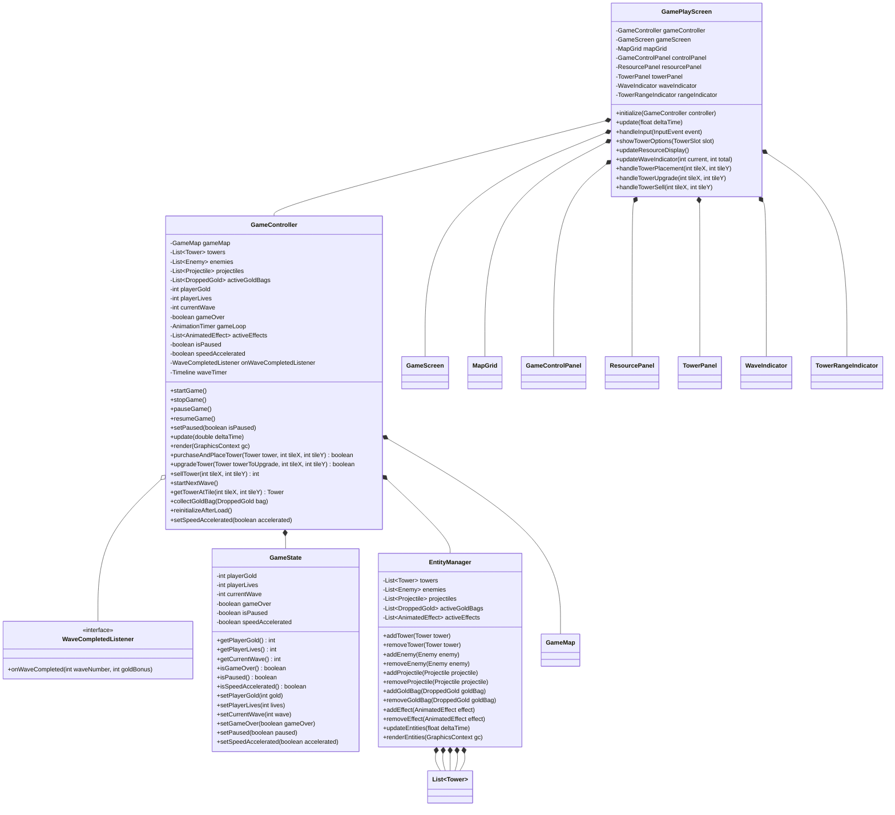

# Class Diagram: Controller Trial

```mermaid
classDiagram
    class GameController {
        -GameMap gameMap
        -List~Tower~ towers
        -List~Enemy~ enemies
        -List~Projectile~ projectiles
        -List~DroppedGold~ activeGoldBags
        -int playerGold
        -int playerLives
        -int currentWave
        -boolean gameOver
        -AnimationTimer gameLoop
        -List~AnimatedEffect~ activeEffects
        -boolean isPaused
        -boolean speedAccelerated
        -WaveCompletedListener onWaveCompletedListener
        -Timeline waveTimer
        +startGame()
        +stopGame()
        +pauseGame()
        +resumeGame()
        +setPaused(boolean isPaused)
        +update(double deltaTime)
        +render(GraphicsContext gc)
        +purchaseAndPlaceTower(Tower tower, int tileX, int tileY) boolean
        +upgradeTower(Tower towerToUpgrade, int tileX, int tileY) boolean
        +sellTower(int tileX, int tileY) int
        +startNextWave()
        +getTowerAtTile(int tileX, int tileY) Tower
        +collectGoldBag(DroppedGold bag)
        +reinitializeAfterLoad()
        +setSpeedAccelerated(boolean accelerated)
    }

    class GamePlayScreen {
        -GameController gameController
        -GameScreen gameScreen
        -MapGrid mapGrid
        -GameControlPanel controlPanel
        -ResourcePanel resourcePanel
        -TowerPanel towerPanel
        -WaveIndicator waveIndicator
        -TowerRangeIndicator rangeIndicator
        +initialize(GameController controller)
        +update(float deltaTime)
        +handleInput(InputEvent event)
        +showTowerOptions(TowerSlot slot)
        +updateResourceDisplay()
        +updateWaveIndicator(int current, int total)
        +handleTowerPlacement(int tileX, int tileY)
        +handleTowerUpgrade(int tileX, int tileY)
        +handleTowerSell(int tileX, int tileY)
    }

    class WaveCompletedListener {
        <<interface>>
        +onWaveCompleted(int waveNumber, int goldBonus)
    }

    class GameState {
        -int playerGold
        -int playerLives
        -int currentWave
        -boolean gameOver
        -boolean isPaused
        -boolean speedAccelerated
        +getPlayerGold() int
        +getPlayerLives() int
        +getCurrentWave() int
        +isGameOver() boolean
        +isPaused() boolean
        +isSpeedAccelerated() boolean
        +setPlayerGold(int gold)
        +setPlayerLives(int lives)
        +setCurrentWave(int wave)
        +setGameOver(boolean gameOver)
        +setPaused(boolean paused)
        +setSpeedAccelerated(boolean accelerated)
    }

    class EntityManager {
        -List~Tower~ towers
        -List~Enemy~ enemies
        -List~Projectile~ projectiles
        -List~DroppedGold~ activeGoldBags
        -List~AnimatedEffect~ activeEffects
        +addTower(Tower tower)
        +removeTower(Tower tower)
        +addEnemy(Enemy enemy)
        +removeEnemy(Enemy enemy)
        +addProjectile(Projectile projectile)
        +removeProjectile(Projectile projectile)
        +addGoldBag(DroppedGold goldBag)
        +removeGoldBag(DroppedGold goldBag)
        +addEffect(AnimatedEffect effect)
        +removeEffect(AnimatedEffect effect)
        +updateEntities(float deltaTime)
        +renderEntities(GraphicsContext gc)
    }

    GameController *-- GameMap
    GameController *-- GameState
    GameController *-- EntityManager
    GameController o-- WaveCompletedListener

    GamePlayScreen *-- GameController
    GamePlayScreen *-- GameScreen
    GamePlayScreen *-- MapGrid
    GamePlayScreen *-- GameControlPanel
    GamePlayScreen *-- ResourcePanel
    GamePlayScreen *-- TowerPanel
    GamePlayScreen *-- WaveIndicator
    GamePlayScreen *-- TowerRangeIndicator

    EntityManager *-- List~Tower~
    EntityManager *-- List~Enemy~
    EntityManager *-- List~Projectile~
    EntityManager *-- List~DroppedGold~
    EntityManager *-- List~AnimatedEffect~
``` 