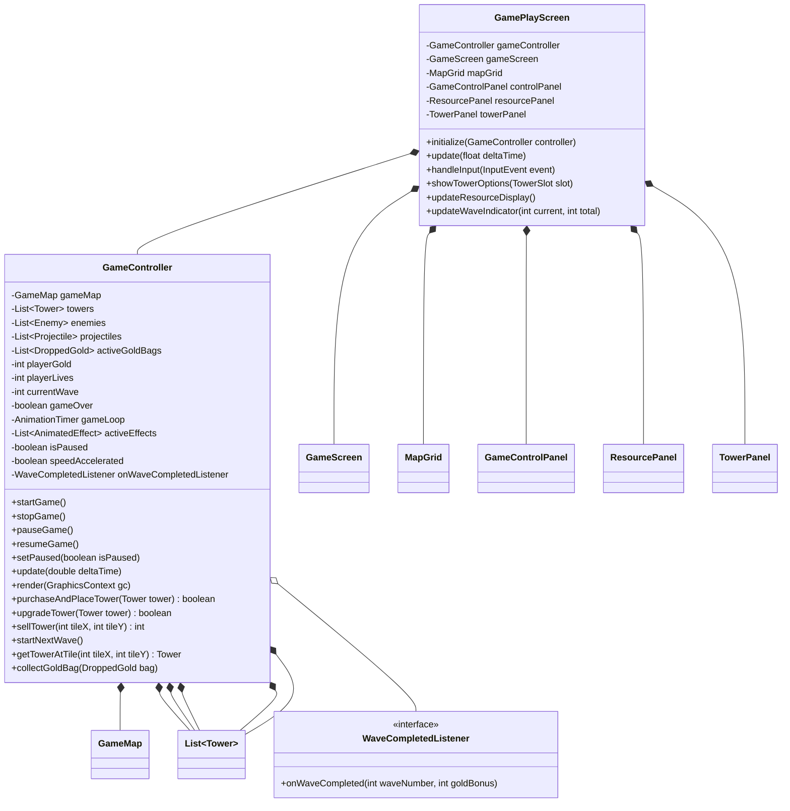

# Class Diagram: Controller

```mermaid
classDiagram
    class GameController {
        -GameMap gameMap
        -List~Tower~ towers
        -List~Enemy~ enemies
        -List~Projectile~ projectiles
        -List~DroppedGold~ activeGoldBags
        -int playerGold
        -int playerLives
        -int currentWave
        -boolean gameOver
        -AnimationTimer gameLoop
        -List~AnimatedEffect~ activeEffects
        -boolean isPaused
        -boolean speedAccelerated
        -WaveCompletedListener onWaveCompletedListener
        +startGame()
        +stopGame()
        +pauseGame()
        +resumeGame()
        +setPaused(boolean isPaused)
        +update(double deltaTime)
        +render(GraphicsContext gc)
        +purchaseAndPlaceTower(Tower tower) boolean
        +upgradeTower(Tower tower) boolean
        +sellTower(int tileX, int tileY) int
        +startNextWave()
        +getTowerAtTile(int tileX, int tileY) Tower
        +collectGoldBag(DroppedGold bag)
    }

    class GamePlayScreen {
        -GameController gameController
        -GameScreen gameScreen
        -MapGrid mapGrid
        -GameControlPanel controlPanel
        -ResourcePanel resourcePanel
        -TowerPanel towerPanel
        +initialize(GameController controller)
        +update(float deltaTime)
        +handleInput(InputEvent event)
        +showTowerOptions(TowerSlot slot)
        +updateResourceDisplay()
        +updateWaveIndicator(int current, int total)
    }

    class WaveCompletedListener {
        <<interface>>
        +onWaveCompleted(int waveNumber, int goldBonus)
    }

    GameController *-- GameMap
    GameController *-- List~Tower~
    GameController *-- List~Enemy~
    GameController *-- List~Projectile~
    GameController *-- List~DroppedGold~
    GameController *-- List~AnimatedEffect~
    GameController o-- WaveCompletedListener

    GamePlayScreen *-- GameController
    GamePlayScreen *-- GameScreen
    GamePlayScreen *-- MapGrid
    GamePlayScreen *-- GameControlPanel
    GamePlayScreen *-- ResourcePanel
    GamePlayScreen *-- TowerPanel
``` 