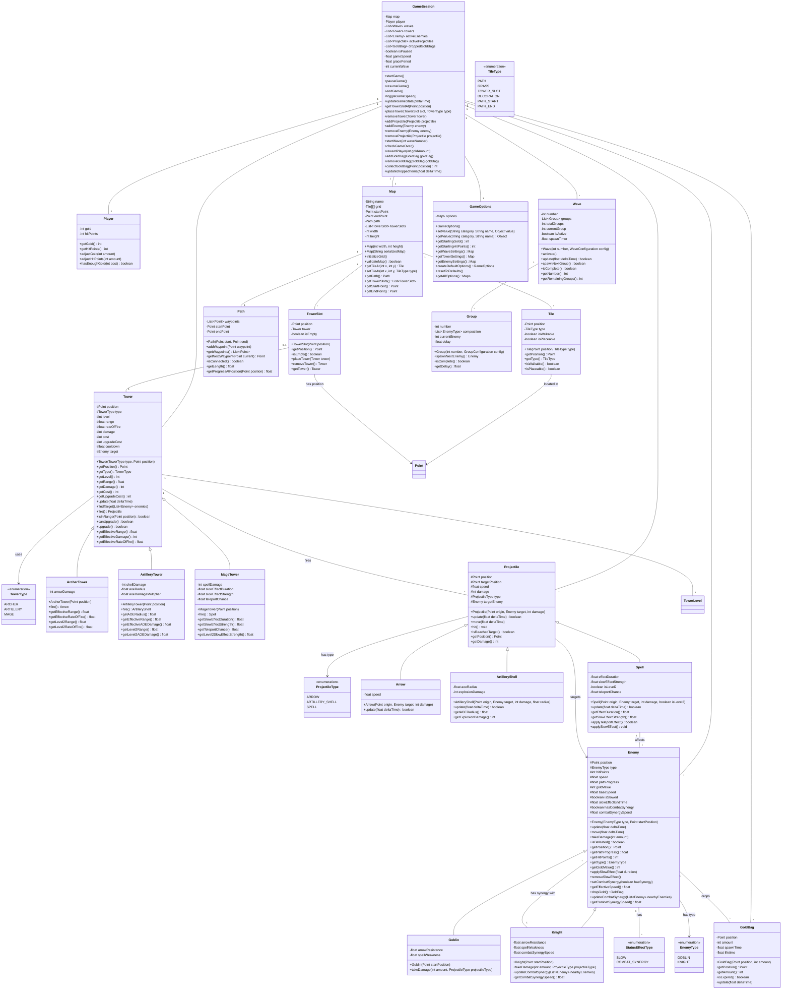

# Class Diagram: Game Model

```mermaid
classDiagram
    class GameSession {
        -Map map
        -Player player
        -List~Wave~ waves
        -List~Tower~ towers
        -List~Enemy~ activeEnemies
        -List~Projectile~ activeProjectiles
        -List~GoldBag~ droppedGoldBags
        -boolean isPaused
        -float gameSpeed
        -float gracePeriod
        -int currentWave
        +startGame()
        +pauseGame()
        +resumeGame()
        +endGame()
        +toggleGameSpeed()
        +updateGameState(deltaTime)
        +getTowerSlotAt(Point position)
        +placeTower(TowerSlot slot, TowerType type)
        +removeTower(Tower tower)
        +addProjectile(Projectile projectile)
        +addEnemy(Enemy enemy)
        +removeEnemy(Enemy enemy)
        +removeProjectile(Projectile projectile)
        +startWave(int waveNumber)
        +checkGameOver()
        +rewardPlayer(int goldAmount)
        +addGoldBag(GoldBag goldBag)
        +removeGoldBag(GoldBag goldBag)
        +collectGoldBag(Point position) int
        +updateDroppedItems(float deltaTime)
    }

    class Player {
        -int gold
        -int hitPoints
        +getGold() int
        +getHitPoints() int
        +adjustGold(int amount)
        +adjustHitPoints(int amount)
        +hasEnoughGold(int cost) boolean
    }

    class Map {
        -String name
        -Tile[][] grid
        -Point startPoint
        -Point endPoint
        -Path path
        -List~TowerSlot~ towerSlots
        -int width
        -int height
        +Map(int width, int height)
        +Map(String serializedMap)
        +initializeGrid()
        +validateMap() boolean
        +getTileAt(int x, int y) Tile
        +setTileAt(int x, int y, TileType type)
        +getPath() Path
        +getTowerSlots() List~TowerSlot~
        +getStartPoint() Point
        +getEndPoint() Point
    }

    class Tile {
        -Point position
        -TileType type
        -boolean isWalkable
        -boolean isPlaceable
        +Tile(Point position, TileType type)
        +getPosition() Point
        +getType() TileType
        +isWalkable() boolean
        +isPlaceable() boolean
    }

    class TileType {
        <<enumeration>>
        PATH
        GRASS
        TOWER_SLOT
        DECORATION
        PATH_START
        PATH_END
    }

    class Path {
        -List~Point~ waypoints
        -Point startPoint
        -Point endPoint
        +Path(Point start, Point end)
        +addWaypoint(Point waypoint)
        +getWaypoints() List~Point~
        +getNextWaypoint(Point current) Point
        +isConnected() boolean
        +getLength() float
        +getProgressAtPosition(Point position) float
    }

    class TowerSlot {
        -Point position
        -Tower tower
        -boolean isEmpty
        +TowerSlot(Point position)
        +getPosition() Point
        +isEmpty() boolean
        +placeTower(Tower tower)
        +removeTower() Tower
        +getTower() Tower
    }

    class Tower {
        #Point position
        #TowerType type
        #int level
        #float range
        #float rateOfFire
        #int damage
        #int cost
        #int upgradeCost
        #float cooldown
        #Enemy target
        +Tower(TowerType type, Point position)
        +getPosition() Point
        +getType() TowerType
        +getLevel() int
        +getRange() float
        +getDamage() int
        +getCost() int
        +getUpgradeCost() int
        +update(float deltaTime)
        +findTarget(List~Enemy~ enemies)
        +fire() Projectile
        +isInRange(Point position) boolean
        +canUpgrade() boolean
        +upgrade() boolean
        +getEffectiveRange() float
        +getEffectiveDamage() int
        +getEffectiveRateOfFire() float
    }

    class TowerType {
        <<enumeration>>
        ARCHER
        ARTILLERY
        MAGE
    }

    class ArcherTower {
        -int arrowDamage
        +ArcherTower(Point position)
        +fire() Arrow
        +getEffectiveRange() float
        +getEffectiveRateOfFire() float
        +getLevel2Range() float
        +getLevel2RateOfFire() float
    }

    class ArtilleryTower {
        -int shellDamage
        -float aoeRadius
        -float aoeDamageMultiplier
        +ArtilleryTower(Point position)
        +fire() ArtilleryShell
        +getAOERadius() float
        +getEffectiveRange() float
        +getEffectiveAOEDamage() float
        +getLevel2Range() float
        +getLevel2AOEDamage() float
    }

    class MageTower {
        -int spellDamage
        -float slowEffectDuration
        -float slowEffectStrength
        -float teleportChance
        +MageTower(Point position)
        +fire() Spell
        +getSlowEffectDuration() float
        +getSlowEffectStrength() float
        +getTeleportChance() float
        +getLevel2SlowEffectStrength() float
    }

    class Projectile {
        #Point position
        #Point targetPosition
        #float speed
        #int damage
        #ProjectileType type
        #Enemy targetEnemy
        +Projectile(Point origin, Enemy target, int damage)
        +update(float deltaTime) boolean
        +move(float deltaTime)
        +hit() void
        +isReachedTarget() boolean
        +getPosition() Point
        +getDamage() int
    }

    class ProjectileType {
        <<enumeration>>
        ARROW
        ARTILLERY_SHELL
        SPELL
    }

    class Arrow {
        -float speed
        +Arrow(Point origin, Enemy target, int damage)
        +update(float deltaTime) boolean
    }

    class ArtilleryShell {
        -float aoeRadius
        -int explosionDamage
        +ArtilleryShell(Point origin, Enemy target, int damage, float radius)
        +update(float deltaTime) boolean
        +getAOERadius() float
        +getExplosionDamage() int
    }

    class Spell {
        -float effectDuration
        -float slowEffectStrength
        -boolean isLevel2
        -float teleportChance
        +Spell(Point origin, Enemy target, int damage, boolean isLevel2)
        +update(float deltaTime) boolean
        +getEffectDuration() float
        +getSlowEffectStrength() float
        +applyTeleportEffect() boolean
        +applySlowEffect() void
    }

    class Enemy {
        #Point position
        #EnemyType type
        #int hitPoints
        #float speed
        #float pathProgress
        #int goldValue
        #float baseSpeed
        #boolean isSlowed
        #float slowEffectEndTime
        #boolean hasCombatSynergy
        #float combatSynergySpeed
        +Enemy(EnemyType type, Point startPosition)
        +update(float deltaTime)
        +move(float deltaTime)
        +takeDamage(int amount)
        +isDefeated() boolean
        +getPosition() Point
        +getPathProgress() float
        +getHitPoints() int
        +getType() EnemyType
        +getGoldValue() int
        +applySlowEffect(float duration)
        +removeSlowEffect()
        +setCombatSynergy(boolean hasSynergy)
        +getEffectiveSpeed() float
        +dropGold() GoldBag
        +updateCombatSynergy(List~Enemy~ nearbyEnemies)
        +getCombatSynergySpeed() float
    }

    class EnemyType {
        <<enumeration>>
        GOBLIN
        KNIGHT
    }

    class Goblin {
        -float arrowResistance
        -float spellWeakness
        +Goblin(Point startPosition)
        +takeDamage(int amount, ProjectileType projectileType)
    }

    class Knight {
        -float arrowResistance
        -float spellWeakness
        -float combatSynergySpeed
        +Knight(Point startPosition)
        +takeDamage(int amount, ProjectileType projectileType)
        +updateCombatSynergy(List~Enemy~ nearbyEnemies)
        +getCombatSynergySpeed() float
    }

    class Wave {
        -int number
        -List~Group~ groups
        -int totalGroups
        -int currentGroup
        -boolean isActive
        -float spawnTimer
        +Wave(int number, WaveConfiguration config)
        +activate()
        +update(float deltaTime) boolean
        +spawnNextGroup() boolean
        +isComplete() boolean
        +getNumber() int
        +getRemainingGroups() int
    }

    class Group {
        -int number
        -List~EnemyType~ composition
        -int currentEnemy
        -float delay
        +Group(int number, GroupConfiguration config)
        +spawnNextEnemy() Enemy
        +isComplete() boolean
        +getDelay() float
    }

    class GameOptions {
        -Map<String, Map<String, Object>> options
        +GameOptions()
        +setValue(String category, String name, Object value)
        +getValue(String category, String name) Object
        +getStartingGold() int
        +getStartingHitPoints() int
        +getWaveSettings() Map<String, Object>
        +getTowerSettings() Map<String, Object>
        +getEnemySettings() Map<String, Object>
        +createDefaultOptions() GameOptions
        +resetToDefaults()
        +getAllOptions() Map<String, Map<String, Object>>
    }

    class GoldBag {
        -Point position
        -int amount
        -float spawnTime
        -float lifetime
        +GoldBag(Point position, int amount)
        +getPosition() Point
        +getAmount() int
        +isExpired() boolean
        +update(float deltaTime)
    }

    class StatusEffectType {
        <<enumeration>>
        SLOW
        COMBAT_SYNERGY
    }

    GameSession "1" -- "1" Player
    GameSession "1" -- "1" Map
    GameSession "1" -- "*" Tower
    GameSession "1" -- "*" Enemy
    GameSession "1" -- "*" Projectile
    GameSession "1" -- "*" Wave
    GameSession "1" -- "1" GameOptions
    Map "1" -- "*" Tile
    Map "1" -- "1" Path
    Map "1" -- "*" TowerSlot
    TowerSlot "0..1" -- "1" Tower
    Tower <|-- ArcherTower
    Tower <|-- ArtilleryTower
    Tower <|-- MageTower
    Projectile <|-- Arrow
    Projectile <|-- ArtilleryShell
    Projectile <|-- Spell
    Enemy <|-- Goblin
    Enemy <|-- Knight
    Wave "1" -- "*" Group
    Tower "1" -- "*" Projectile : fires
    GameSession "1" -- "*" GoldBag
    Enemy "1" -- "*" GoldBag : drops
    Tower "1" -- "1" TowerLevel
    Spell "1" -- "1" Enemy : affects
    Knight "1" -- "*" Enemy : has synergy with
    Enemy "1" -- "*" StatusEffectType : has
%% Additional semantic relationships
    Enemy --> EnemyType : has type
    Projectile --> ProjectileType : has type
    Projectile --> Enemy : targets
    Tower --> TowerType : uses
    Tile --> Point : located at
    TowerSlot --> Point : has position

``` 
