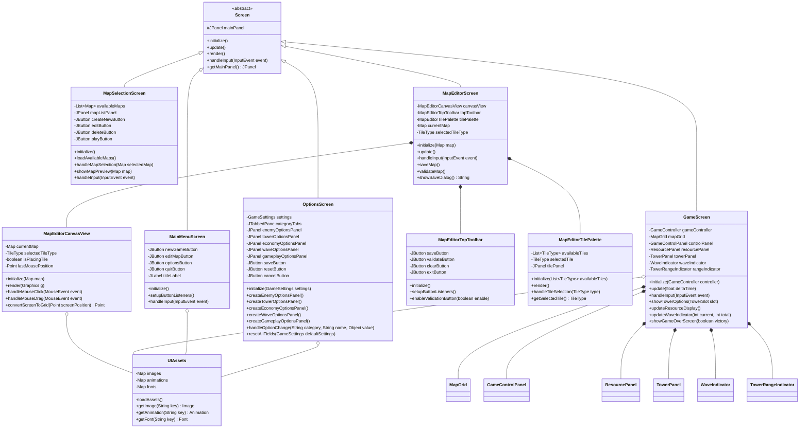

# Class Diagram: UI Components

```mermaid
classDiagram
    class Screen {
        <<abstract>>
        #JPanel mainPanel
        +initialize()
        +update()
        +render()
        +handleInput(InputEvent event)
        +getMainPanel() JPanel
    }

    class MainMenuScreen {
        -JButton newGameButton
        -JButton editMapButton
        -JButton optionsButton
        -JButton quitButton
        -JLabel titleLabel
        +initialize()
        +setupButtonListeners()
        +handleInput(InputEvent event)
    }

    class MapSelectionScreen {
        -List~Map~ availableMaps
        -JPanel mapListPanel
        -JButton createNewButton
        -JButton editButton
        -JButton deleteButton
        -JButton playButton
        +initialize()
        +loadAvailableMaps()
        +handleMapSelection(Map selectedMap)
        +showMapPreview(Map map)
        +handleInput(InputEvent event)
    }

    class GameScreen {
        -GameController gameController
        -MapGrid mapGrid
        -GameControlPanel controlPanel
        -ResourcePanel resourcePanel
        -TowerPanel towerPanel
        -WaveIndicator waveIndicator
        -TowerRangeIndicator rangeIndicator
        +initialize(GameController controller)
        +update(float deltaTime)
        +handleInput(InputEvent event)
        +showTowerOptions(TowerSlot slot)
        +updateResourceDisplay()
        +updateWaveIndicator(int current, int total)
        +showGameOverScreen(boolean victory)
    }

    class MapEditorScreen {
        -MapEditorCanvasView canvasView
        -MapEditorTopToolbar topToolbar
        -MapEditorTilePalette tilePalette
        -Map currentMap
        -TileType selectedTileType
        +initialize(Map map)
        +update()
        +handleInput(InputEvent event)
        +saveMap()
        +validateMap()
        +showSaveDialog() String
    }

    class MapEditorCanvasView {
        -Map currentMap
        -TileType selectedTileType
        -boolean isPlacingTile
        -Point lastMousePosition
        +initialize(Map map)
        +render(Graphics g)
        +handleMouseClick(MouseEvent event)
        +handleMouseDrag(MouseEvent event)
        +convertScreenToGrid(Point screenPosition) Point
    }

    class MapEditorTopToolbar {
        -JButton saveButton
        -JButton validateButton
        -JButton clearButton
        -JButton exitButton
        +initialize()
        +setupButtonListeners()
        +enableValidationButton(boolean enable)
    }

    class MapEditorTilePalette {
        -List~TileType~ availableTiles
        -TileType selectedTile
        -JPanel tilePanel
        +initialize(List~TileType~ availableTiles)
        +render()
        +handleTileSelection(TileType type)
        +getSelectedTile() TileType
    }

    class OptionsScreen {
        -GameSettings settings
        -JTabbedPane categoryTabs
        -JPanel enemyOptionsPanel
        -JPanel towerOptionsPanel
        -JPanel economyOptionsPanel
        -JPanel waveOptionsPanel
        -JPanel gameplayOptionsPanel
        -JButton saveButton
        -JButton resetButton
        -JButton cancelButton
        +initialize(GameSettings settings)
        +createEnemyOptionsPanel()
        +createTowerOptionsPanel()
        +createEconomyOptionsPanel()
        +createWaveOptionsPanel()
        +createGameplayOptionsPanel()
        +handleOptionChange(String category, String name, Object value)
        +resetAllFields(GameSettings defaultSettings)
    }

    class UIAssets {
        -Map<String, Image> images
        -Map<String, Animation> animations
        -Map<String, Font> fonts
        +loadAssets()
        +getImage(String key) Image
        +getAnimation(String key) Animation
        +getFont(String key) Font
    }

    Screen <|-- MainMenuScreen
    Screen <|-- MapSelectionScreen
    Screen <|-- GameScreen
    Screen <|-- MapEditorScreen
    Screen <|-- OptionsScreen

    MapEditorScreen *-- MapEditorCanvasView
    MapEditorScreen *-- MapEditorTopToolbar
    MapEditorScreen *-- MapEditorTilePalette

    GameScreen *-- MapGrid
    GameScreen *-- GameControlPanel
    GameScreen *-- ResourcePanel
    GameScreen *-- TowerPanel
    GameScreen *-- WaveIndicator
    GameScreen *-- TowerRangeIndicator

    MapEditorCanvasView o-- UIAssets
    GameScreen o-- UIAssets
    MainMenuScreen o-- UIAssets
    OptionsScreen o-- UIAssets
``` 