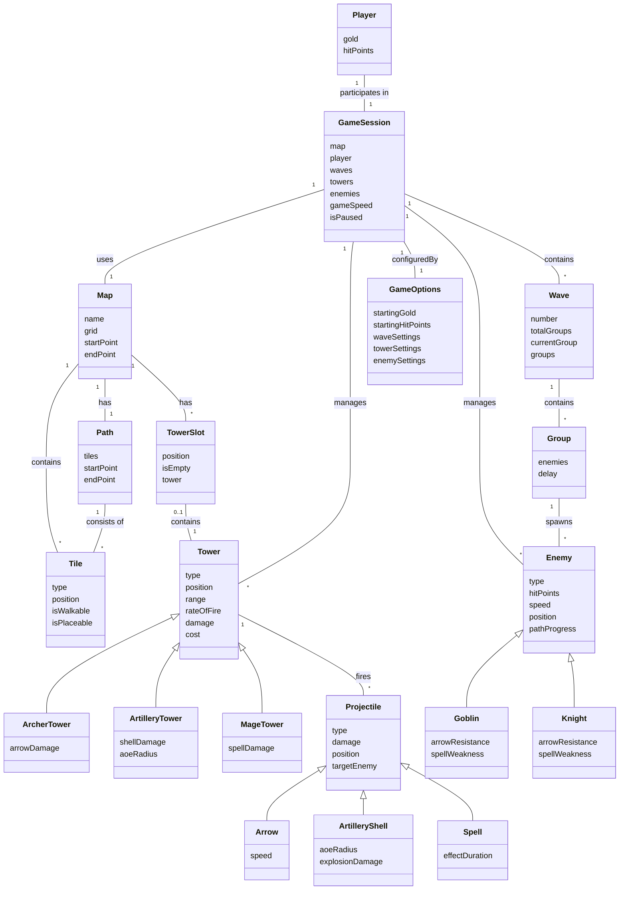

```mermaid
classDiagram
    title KU Tower Defense Domain Model

    class Player {
        gold
        hitPoints
        
    }

    class Map {
        name
        grid
        startPoint
        endPoint
        
    }

    class Tile {
        type
        position
        isWalkable
        isPlaceable
    }

    class Path {
        tiles
        startPoint
        endPoint
        
    }

    class TowerSlot {
        position
        isEmpty
        tower
    }

    class Tower {
        type
        position
        range
        rateOfFire
        damage
        cost
        
    }

    class ArcherTower {
        arrowDamage
    }

    class ArtilleryTower {
        shellDamage
        aoeRadius
    }

    class MageTower {
        spellDamage
    }

    class Projectile {
        type
        damage
        position
        targetEnemy
       
    }

    class Arrow {
        speed
    }

    class ArtilleryShell {
        aoeRadius
        explosionDamage
    }

    class Spell {
        effectDuration
    }

    class Enemy {
        type
        hitPoints
        speed
        position
        pathProgress
       
    }

    class Goblin {
        arrowResistance
        spellWeakness
    }

    class Knight {
        arrowResistance
        spellWeakness
    }

    class Wave {
        number
        totalGroups
        currentGroup
        groups
        
    }

    class Group {
        enemies
        delay
        
    }

    class GameSession {
        map
        player
        waves
        towers
        enemies
        gameSpeed
        isPaused
        
    }

    class GameOptions {
        startingGold
        startingHitPoints
        waveSettings
        towerSettings
        enemySettings
       
    }

    %% Relationships
    Player "1" -- "1" GameSession : participates in
    Map "1" -- "*" Tile : contains
    Map "1" -- "1" Path : has
    Map "1" -- "*" TowerSlot : has
    Path "1" -- "*" Tile : consists of
    TowerSlot "0..1" -- "1" Tower : contains
    Tower <|-- ArcherTower
    Tower <|-- ArtilleryTower
    Tower <|-- MageTower
    Tower "1" -- "*" Projectile : fires
    Projectile <|-- Arrow
    Projectile <|-- ArtilleryShell
    Projectile <|-- Spell
    Enemy <|-- Goblin
    Enemy <|-- Knight
    GameSession "1" -- "1" Map : uses
    GameSession "1" -- "*" Tower : manages
    GameSession "1" -- "*" Enemy : manages
    GameSession "1" -- "*" Wave : contains
    Wave "1" -- "*" Group : contains
    Group "1" -- "*" Enemy : spawns
    GameSession "1" -- "1" GameOptions : configuredBy
``` 
