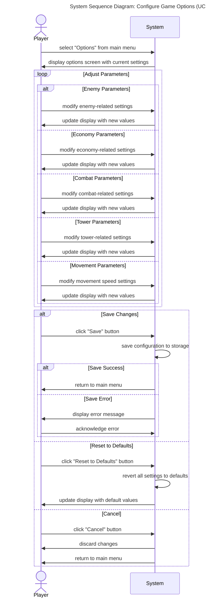

```mermaid
sequenceDiagram
    title System Sequence Diagram: Configure Game Options (UC13)
    
    actor Player
    participant System
    
    Player->>System: select "Options" from main menu
    System->>Player: display options screen with current settings
    
    loop Adjust Parameters
        alt Enemy Parameters
            Player->>System: modify enemy-related settings
            System->>Player: update display with new values
        else Economy Parameters
            Player->>System: modify economy-related settings
            System->>Player: update display with new values
        else Combat Parameters
            Player->>System: modify combat-related settings
            System->>Player: update display with new values
        else Tower Parameters
            Player->>System: modify tower-related settings
            System->>Player: update display with new values
        else Movement Parameters
            Player->>System: modify movement speed settings
            System->>Player: update display with new values
        end
    end
    
    alt Save Changes
        Player->>System: click "Save" button
        System->>System: save configuration to storage
        
        alt Save Success
            System->>Player: return to main menu
        else Save Error
            System->>Player: display error message
            Player->>System: acknowledge error
        end
        
    else Reset to Defaults
        Player->>System: click "Reset to Defaults" button
        System->>System: revert all settings to defaults
        System->>Player: update display with default values
        
    else Cancel
        Player->>System: click "Cancel" button
        System->>Player: discard changes
        System->>Player: return to main menu
    end
``` 