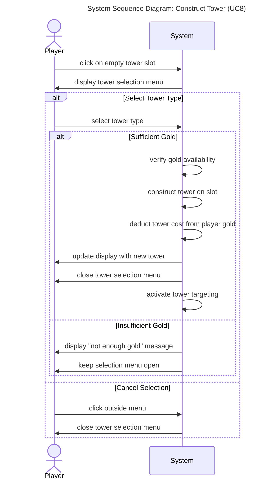

```mermaid
sequenceDiagram
    title System Sequence Diagram: Construct Tower (UC8)
    
    actor Player
    participant System
    
    Player->>System: click on empty tower slot
    System->>Player: display tower selection menu
    
    alt Select Tower Type
        Player->>System: select tower type
        
        alt Sufficient Gold
            System->>System: verify gold availability
            System->>System: construct tower on slot
            System->>System: deduct tower cost from player gold
            System->>Player: update display with new tower
            System->>Player: close tower selection menu
            System->>System: activate tower targeting
        else Insufficient Gold
            System->>Player: display "not enough gold" message
            System->>Player: keep selection menu open
        end
        
    else Cancel Selection
        Player->>System: click outside menu
        System->>Player: close tower selection menu
    end
``` 