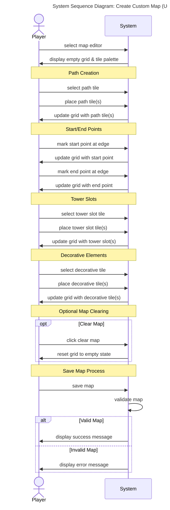

```mermaid
sequenceDiagram
    title System Sequence Diagram: Create Custom Map (UC5)
    
    actor Player
    participant System
    
    Player->>System: select map editor
    System->>Player: display empty grid & tile palette
    
    Note over Player,System: Path Creation
    Player->>System: select path tile
    Player->>System: place path tile(s)
    System->>Player: update grid with path tile(s)
    
    Note over Player,System: Start/End Points
    Player->>System: mark start point at edge
    System->>Player: update grid with start point
    Player->>System: mark end point at edge
    System->>Player: update grid with end point
    
    Note over Player,System: Tower Slots
    Player->>System: select tower slot tile
    Player->>System: place tower slot tile(s)
    System->>Player: update grid with tower slot(s)
    
    Note over Player,System: Decorative Elements
    Player->>System: select decorative tile
    Player->>System: place decorative tile(s)
    System->>Player: update grid with decorative tile(s)
    
    Note over Player,System: Optional Map Clearing
    opt Clear Map
        Player->>System: click clear map
        System->>Player: reset grid to empty state
    end
    
    Note over Player,System: Save Map Process
    Player->>System: save map
    System->>System: validate map
    
    alt Valid Map
        System->>Player: display success message
    else Invalid Map
        System->>Player: display error message
    end
``` 