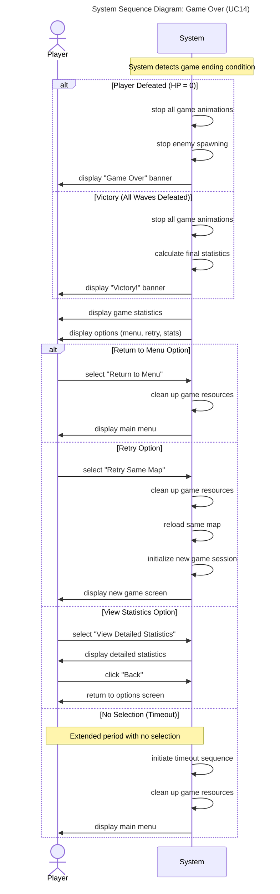

```mermaid
sequenceDiagram
    title System Sequence Diagram: Game Over (UC14)
    
    actor Player
    participant System
    
    Note over System: System detects game ending condition
    
    alt Player Defeated (HP = 0)
        System->>System: stop all game animations
        System->>System: stop enemy spawning
        System->>Player: display "Game Over" banner
        
    else Victory (All Waves Defeated)
        System->>System: stop all game animations
        System->>System: calculate final statistics
        System->>Player: display "Victory!" banner
    end
    
    System->>Player: display game statistics
    System->>Player: display options (menu, retry, stats)
    
    alt Return to Menu Option
        Player->>System: select "Return to Menu"
        System->>System: clean up game resources
        System->>Player: display main menu
        
    else Retry Option
        Player->>System: select "Retry Same Map"
        System->>System: clean up game resources
        System->>System: reload same map
        System->>System: initialize new game session
        System->>Player: display new game screen
        
    else View Statistics Option
        Player->>System: select "View Detailed Statistics"
        System->>Player: display detailed statistics
        Player->>System: click "Back"
        System->>Player: return to options screen
        
    else No Selection (Timeout)
        Note over Player,System: Extended period with no selection
        System->>System: initiate timeout sequence
        System->>System: clean up game resources
        System->>Player: display main menu
    end
``` 