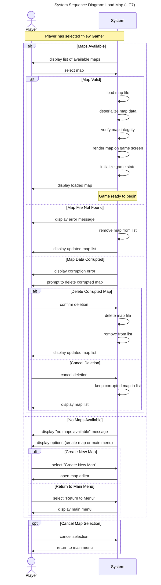

```mermaid
sequenceDiagram
    title System Sequence Diagram: Load Map (UC7)
    
    actor Player
    participant System
    
    Note over Player,System: Player has selected "New Game"
    
    alt Maps Available
        System->>Player: display list of available maps
        Player->>System: select map
        
        alt Map Valid
            System->>System: load map file
            System->>System: deserialize map data
            System->>System: verify map integrity
            System->>System: render map on game screen
            System->>System: initialize game state
            System->>Player: display loaded map
            Note over System: Game ready to begin
            
        else Map File Not Found
            System->>Player: display error message
            System->>System: remove map from list
            System->>Player: display updated map list
            
        else Map Data Corrupted
            System->>Player: display corruption error
            System->>Player: prompt to delete corrupted map
            
            alt Delete Corrupted Map
                Player->>System: confirm deletion
                System->>System: delete map file
                System->>System: remove from list
                System->>Player: display updated map list
                
            else Cancel Deletion
                Player->>System: cancel deletion
                System->>System: keep corrupted map in list
                System->>Player: display map list
            end
        end
        
    else No Maps Available
        System->>Player: display "no maps available" message
        System->>Player: display options (create map or main menu)
        
        alt Create New Map
            Player->>System: select "Create New Map"
            System->>Player: open map editor
            
        else Return to Main Menu
            Player->>System: select "Return to Menu"
            System->>Player: display main menu
        end
    end
    
    opt Cancel Map Selection
        Player->>System: cancel selection
        System->>Player: return to main menu
    end
``` 