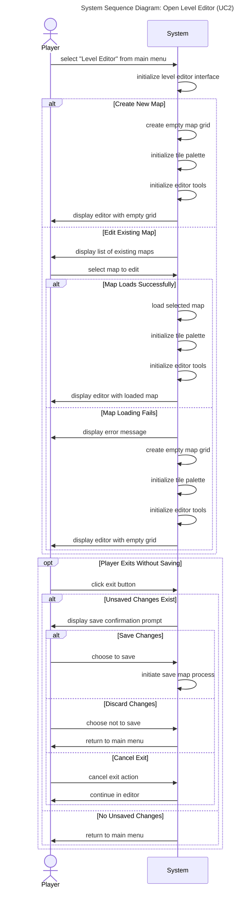

```mermaid
sequenceDiagram
    title System Sequence Diagram: Open Level Editor (UC2)
    
    actor Player
    participant System
    
    Player->>System: select "Level Editor" from main menu
    System->>System: initialize level editor interface
    
    alt Create New Map
        System->>System: create empty map grid
        System->>System: initialize tile palette
        System->>System: initialize editor tools
        System->>Player: display editor with empty grid
        
    else Edit Existing Map
        System->>Player: display list of existing maps
        Player->>System: select map to edit
        
        alt Map Loads Successfully
            System->>System: load selected map
            System->>System: initialize tile palette
            System->>System: initialize editor tools
            System->>Player: display editor with loaded map
            
        else Map Loading Fails
            System->>Player: display error message
            System->>System: create empty map grid
            System->>System: initialize tile palette
            System->>System: initialize editor tools
            System->>Player: display editor with empty grid
        end
    end
    
    opt Player Exits Without Saving
        Player->>System: click exit button
        
        alt Unsaved Changes Exist
            System->>Player: display save confirmation prompt
            
            alt Save Changes
                Player->>System: choose to save
                System->>System: initiate save map process
                
            else Discard Changes
                Player->>System: choose not to save
                System->>Player: return to main menu
                
            else Cancel Exit
                Player->>System: cancel exit action
                System->>Player: continue in editor
            end
            
        else No Unsaved Changes
            System->>Player: return to main menu
        end
    end
``` 