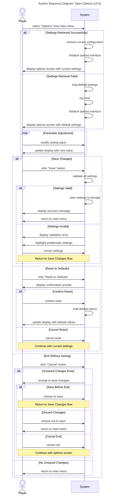

```mermaid
sequenceDiagram
    title System Sequence Diagram: Open Options (UC3)
    
    actor Player
    participant System
    
    Player->>System: select "Options" from main menu
    
    alt Settings Retrieved Successfully
        System->>System: retrieve current configuration
        System->>System: initialize options interface
        System->>Player: display options screen with current settings
        
    else Settings Retrieval Fails
        System->>System: load default settings
        System->>System: log error
        System->>System: initialize options interface
        System->>Player: display options screen with default settings
    end
    
    loop Parameter Adjustment
        Player->>System: modify setting value
        System->>Player: update display with new value
    end
    
    alt Save Changes
        Player->>System: click "Save" button
        System->>System: validate all settings
        
        alt Settings Valid
            System->>System: save settings to storage
            System->>Player: display success message
            System->>Player: return to main menu
            
        else Settings Invalid
            System->>Player: display validation error
            System->>Player: highlight problematic settings
            
            Player->>System: correct settings
            Note over Player,System: Return to Save Changes flow
        end
        
    else Reset to Defaults
        Player->>System: click "Reset to Defaults"
        System->>Player: display confirmation prompt
        
        alt Confirm Reset
            Player->>System: confirm reset
            System->>System: load default values
            System->>Player: update display with default values
            
        else Cancel Reset
            Player->>System: cancel reset
            Note over Player,System: Continue with current settings
        end
        
    else Exit Without Saving
        Player->>System: click "Cancel" button
        
        alt Unsaved Changes Exist
            System->>Player: prompt to save changes
            
            alt Save Before Exit
                Player->>System: choose to save
                Note over Player,System: Return to Save Changes flow
                
            else Discard Changes
                Player->>System: choose not to save
                System->>Player: return to main menu
                
            else Cancel Exit
                Player->>System: cancel exit
                Note over Player,System: Continue with options screen
            end
            
        else No Unsaved Changes
            System->>Player: return to main menu
        end
    end
``` 