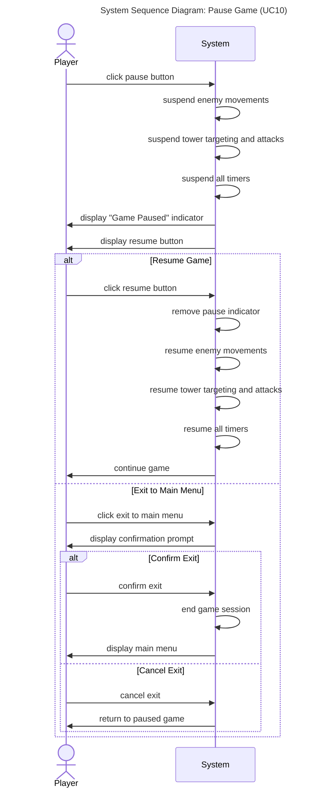

```mermaid
sequenceDiagram
    title System Sequence Diagram: Pause Game (UC10)
    
    actor Player
    participant System
    
    Player->>System: click pause button
    System->>System: suspend enemy movements
    System->>System: suspend tower targeting and attacks
    System->>System: suspend all timers
    System->>Player: display "Game Paused" indicator
    System->>Player: display resume button
    
    alt Resume Game
        Player->>System: click resume button
        System->>System: remove pause indicator
        System->>System: resume enemy movements
        System->>System: resume tower targeting and attacks
        System->>System: resume all timers
        System->>Player: continue game
        
    else Exit to Main Menu
        Player->>System: click exit to main menu
        System->>Player: display confirmation prompt
        
        alt Confirm Exit
            Player->>System: confirm exit
            System->>System: end game session
            System->>Player: display main menu
            
        else Cancel Exit
            Player->>System: cancel exit
            System->>Player: return to paused game
        end
    end
``` 