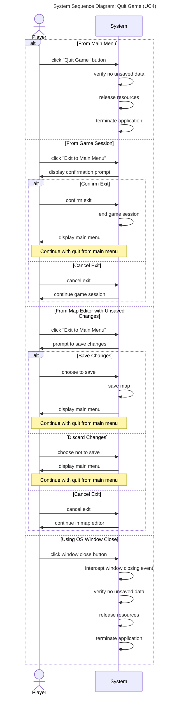

```mermaid
sequenceDiagram
    title System Sequence Diagram: Quit Game (UC4)
    
    actor Player
    participant System
    
    alt From Main Menu
        Player->>System: click "Quit Game" button
        System->>System: verify no unsaved data
        System->>System: release resources
        System->>System: terminate application
        
    else From Game Session
        Player->>System: click "Exit to Main Menu"
        System->>Player: display confirmation prompt
        
        alt Confirm Exit
            Player->>System: confirm exit
            System->>System: end game session
            System->>Player: display main menu
            
            Note over Player,System: Continue with quit from main menu
            
        else Cancel Exit
            Player->>System: cancel exit
            System->>Player: continue game session
        end
        
    else From Map Editor with Unsaved Changes
        Player->>System: click "Exit to Main Menu"
        System->>Player: prompt to save changes
        
        alt Save Changes
            Player->>System: choose to save
            System->>System: save map
            System->>Player: display main menu
            
            Note over Player,System: Continue with quit from main menu
            
        else Discard Changes
            Player->>System: choose not to save
            System->>Player: display main menu
            
            Note over Player,System: Continue with quit from main menu
            
        else Cancel Exit
            Player->>System: cancel exit
            System->>Player: continue in map editor
        end
        
    else Using OS Window Close
        Player->>System: click window close button
        System->>System: intercept window closing event
        System->>System: verify no unsaved data
        System->>System: release resources
        System->>System: terminate application
    end
``` 