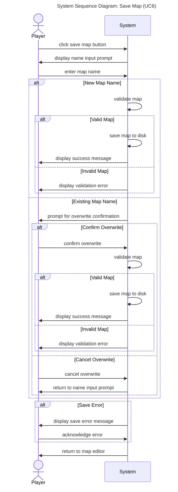

```mermaid
sequenceDiagram
    title System Sequence Diagram: Save Map (UC6)
    
    actor Player
    participant System
    
    Player->>System: click save map button
    System->>Player: display name input prompt
    Player->>System: enter map name
    
    alt New Map Name
        System->>System: validate map
        
        alt Valid Map
            System->>System: save map to disk
            System->>Player: display success message
        else Invalid Map
            System->>Player: display validation error
        end
        
    else Existing Map Name
        System->>Player: prompt for overwrite confirmation
        
        alt Confirm Overwrite
            Player->>System: confirm overwrite
            System->>System: validate map
            
            alt Valid Map
                System->>System: save map to disk
                System->>Player: display success message
            else Invalid Map
                System->>Player: display validation error
            end
            
        else Cancel Overwrite
            Player->>System: cancel overwrite
            System->>Player: return to name input prompt
        end
    end
    
    alt Save Error
        System->>Player: display save error message
        Player->>System: acknowledge error
    end
    
    System->>Player: return to map editor
``` 