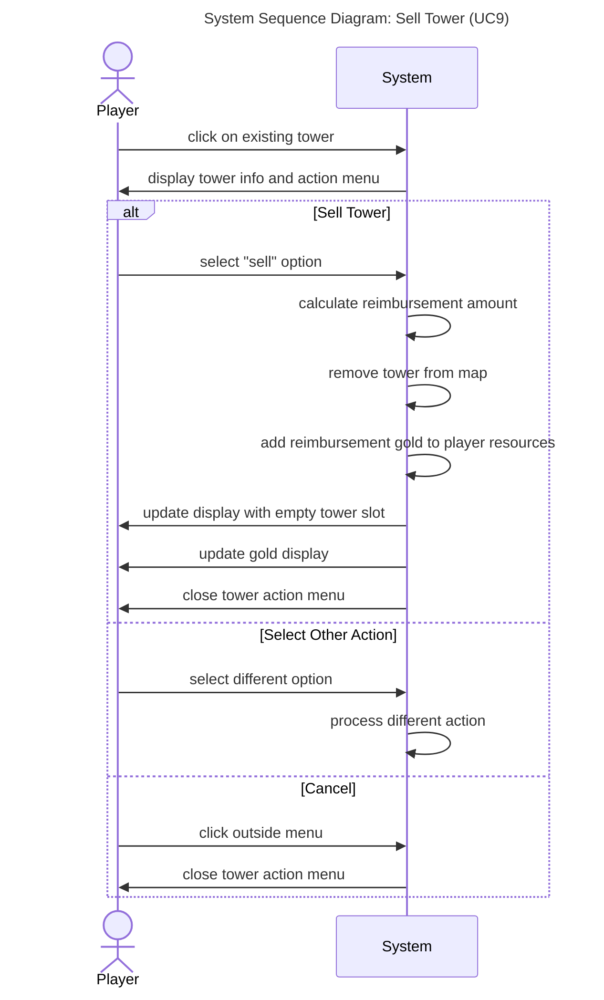

```mermaid
sequenceDiagram
    title System Sequence Diagram: Sell Tower (UC9)
    
    actor Player
    participant System
    
    Player->>System: click on existing tower
    System->>Player: display tower info and action menu
    
    alt Sell Tower
        Player->>System: select "sell" option
        System->>System: calculate reimbursement amount
        System->>System: remove tower from map
        System->>System: add reimbursement gold to player resources
        System->>Player: update display with empty tower slot
        System->>Player: update gold display
        System->>Player: close tower action menu
        
    else Select Other Action
        Player->>System: select different option
        System->>System: process different action
        
    else Cancel
        Player->>System: click outside menu
        System->>Player: close tower action menu
    end
``` 