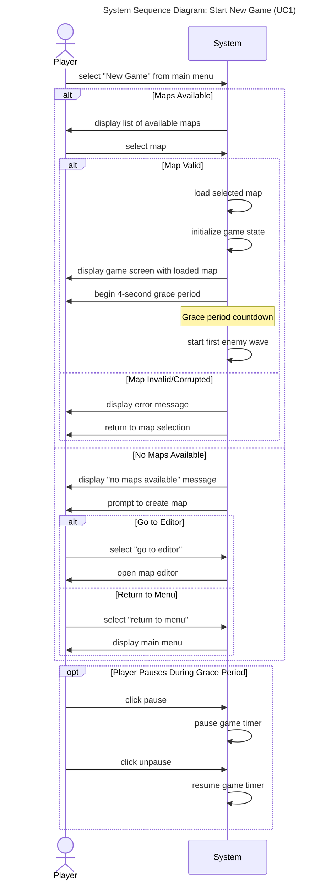

```mermaid
sequenceDiagram
    title System Sequence Diagram: Start New Game (UC1)
    
    actor Player
    participant System
    
    Player->>System: select "New Game" from main menu
    
    alt Maps Available
        System->>Player: display list of available maps
        Player->>System: select map
        
        alt Map Valid
            System->>System: load selected map
            System->>System: initialize game state
            System->>Player: display game screen with loaded map
            System->>Player: begin 4-second grace period
            Note over System: Grace period countdown
            System->>System: start first enemy wave
        else Map Invalid/Corrupted
            System->>Player: display error message
            System->>Player: return to map selection
        end
        
    else No Maps Available
        System->>Player: display "no maps available" message
        System->>Player: prompt to create map
        
        alt Go to Editor
            Player->>System: select "go to editor"
            System->>Player: open map editor
        else Return to Menu
            Player->>System: select "return to menu"
            System->>Player: display main menu
        end
    end
    
    opt Player Pauses During Grace Period
        Player->>System: click pause
        System->>System: pause game timer
        Player->>System: click unpause
        System->>System: resume game timer
    end
``` 