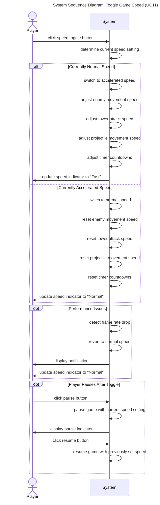

```mermaid
sequenceDiagram
    title System Sequence Diagram: Toggle Game Speed (UC11)
    
    actor Player
    participant System
    
    Player->>System: click speed toggle button
    System->>System: determine current speed setting
    
    alt Currently Normal Speed
        System->>System: switch to accelerated speed
        System->>System: adjust enemy movement speed
        System->>System: adjust tower attack speed
        System->>System: adjust projectile movement speed
        System->>System: adjust timer countdowns
        System->>Player: update speed indicator to "Fast"
        
    else Currently Accelerated Speed
        System->>System: switch to normal speed
        System->>System: reset enemy movement speed
        System->>System: reset tower attack speed
        System->>System: reset projectile movement speed
        System->>System: reset timer countdowns
        System->>Player: update speed indicator to "Normal"
    end
    
    opt Performance Issues
        System->>System: detect frame rate drop
        System->>System: revert to normal speed
        System->>Player: display notification
        System->>Player: update speed indicator to "Normal"
    end
    
    opt Player Pauses After Toggle
        Player->>System: click pause button
        System->>System: pause game with current speed setting
        System->>Player: display pause indicator
        
        Player->>System: click resume button
        System->>System: resume game with previously set speed
    end
``` 