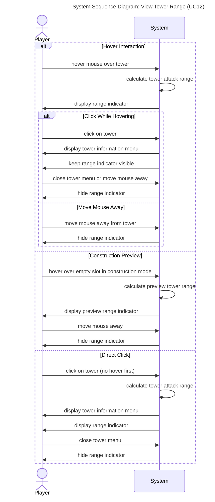

```mermaid
sequenceDiagram
    title System Sequence Diagram: View Tower Range (UC12)
    
    actor Player
    participant System
    
    alt Hover Interaction
        Player->>System: hover mouse over tower
        System->>System: calculate tower attack range
        System->>Player: display range indicator
        
        alt Click While Hovering
            Player->>System: click on tower
            System->>Player: display tower information menu
            System->>Player: keep range indicator visible
            Player->>System: close tower menu or move mouse away
            System->>Player: hide range indicator
        else Move Mouse Away
            Player->>System: move mouse away from tower
            System->>Player: hide range indicator
        end
        
    else Construction Preview
        Player->>System: hover over empty slot in construction mode
        System->>System: calculate preview tower range
        System->>Player: display preview range indicator
        Player->>System: move mouse away
        System->>Player: hide range indicator
        
    else Direct Click
        Player->>System: click on tower (no hover first)
        System->>System: calculate tower attack range
        System->>Player: display tower information menu
        System->>Player: display range indicator
        Player->>System: close tower menu
        System->>Player: hide range indicator
    end
``` 