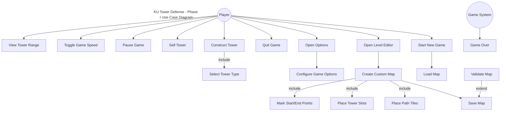

```mermaid
graph TD
    title[KU Tower Defense - Phase I Use Case Diagram]
    style title fill:none,stroke:none

    %% Actors
    Player((Player))

    %% Main Use Cases
    UC1[Start New Game]
    UC2[Open Level Editor]
    UC3[Open Options]
    UC4[Quit Game]
    UC5[Create Custom Map]
    UC6[Save Map]
    UC7[Load Map]
    UC8[Construct Tower]
    UC9[Sell Tower]
    UC10[Pause Game]
    UC11[Toggle Game Speed]
    UC12[View Tower Range]
    UC13[Configure Game Options]
    UC14[Game Over]

    %% Relationships
    Player --> UC1
    Player --> UC2
    Player --> UC3
    Player --> UC4
    
    UC2 --> UC5
    UC5 --> UC6
    
    UC1 --> UC7
    
    Player --> UC8
    Player --> UC9
    Player --> UC10
    Player --> UC11
    Player --> UC12
    
    UC3 --> UC13
    
    GameSystem((Game System)) --> UC14
    
    %% Include relationships
    UC5 -->|include| place_path[Place Path Tiles]
    UC5 -->|include| place_tower_slots[Place Tower Slots]
    UC5 -->|include| mark_start_end[Mark Start/End Points]
    
    UC8 -->|include| select_tower_type[Select Tower Type]
    
    %% Extend relationships
    validate_map[Validate Map] -->|extend| UC6
``` 