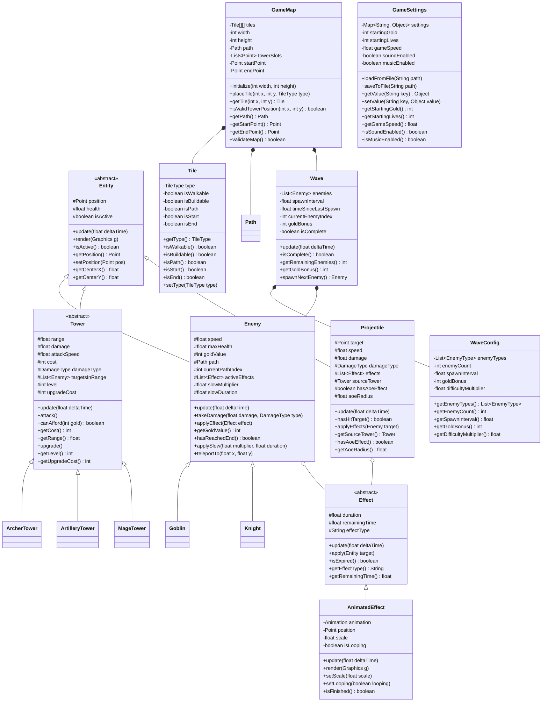

# Class Diagram: Game Model

```mermaid
classDiagram
    class Entity {
        <<abstract>>
        #Point position
        #float health
        #boolean isActive
        +update(float deltaTime)
        +render(Graphics g)
        +isActive() boolean
        +getPosition() Point
        +setPosition(Point pos)
        +getCenterX() float
        +getCenterY() float
    }

    class Enemy {
        #float speed
        #float maxHealth
        #int goldValue
        #Path path
        #int currentPathIndex
        #List~Effect~ activeEffects
        #float slowMultiplier
        #float slowDuration
        +update(float deltaTime)
        +takeDamage(float damage, DamageType type)
        +applyEffect(Effect effect)
        +getGoldValue() int
        +hasReachedEnd() boolean
        +applySlow(float multiplier, float duration)
        +teleportTo(float x, float y)
    }

    class Tower {
        <<abstract>>
        #float range
        #float damage
        #float attackSpeed
        #int cost
        #DamageType damageType
        #List~Enemy~ targetsInRange
        #int level
        #int upgradeCost
        +update(float deltaTime)
        +attack()
        +canAfford(int gold) boolean
        +getCost() int
        +getRange() float
        +upgrade()
        +getLevel() int
        +getUpgradeCost() int
    }

    class Projectile {
        #Point target
        #float speed
        #float damage
        #DamageType damageType
        #List~Effect~ effects
        #Tower sourceTower
        #boolean hasAoeEffect
        #float aoeRadius
        +update(float deltaTime)
        +hasHitTarget() boolean
        +applyEffects(Enemy target)
        +getSourceTower() Tower
        +hasAoeEffect() boolean
        +getAoeRadius() float
    }

    class GameMap {
        -Tile[][] tiles
        -int width
        -int height
        -Path path
        -List~Point~ towerSlots
        -Point startPoint
        -Point endPoint
        +initialize(int width, int height)
        +placeTile(int x, int y, TileType type)
        +getTile(int x, int y) Tile
        +isValidTowerPosition(int x, int y) boolean
        +getPath() Path
        +getStartPoint() Point
        +getEndPoint() Point
        +validateMap() boolean
    }

    class Tile {
        -TileType type
        -boolean isWalkable
        -boolean isBuildable
        -boolean isPath
        -boolean isStart
        -boolean isEnd
        +getType() TileType
        +isWalkable() boolean
        +isBuildable() boolean
        +isPath() boolean
        +isStart() boolean
        +isEnd() boolean
        +setType(TileType type)
    }

    class Wave {
        -List~Enemy~ enemies
        -float spawnInterval
        -float timeSinceLastSpawn
        -int currentEnemyIndex
        -int goldBonus
        -boolean isComplete
        +update(float deltaTime)
        +isComplete() boolean
        +getRemainingEnemies() int
        +getGoldBonus() int
        +spawnNextEnemy() Enemy
    }

    class WaveConfig {
        -List~EnemyType~ enemyTypes
        -int enemyCount
        -float spawnInterval
        -int goldBonus
        -float difficultyMultiplier
        +getEnemyTypes() List~EnemyType~
        +getEnemyCount() int
        +getSpawnInterval() float
        +getGoldBonus() int
        +getDifficultyMultiplier() float
    }

    class Effect {
        <<abstract>>
        #float duration
        #float remainingTime
        #String effectType
        +update(float deltaTime)
        +apply(Entity target)
        +isExpired() boolean
        +getEffectType() String
        +getRemainingTime() float
    }

    class AnimatedEffect {
        -Animation animation
        -Point position
        -float scale
        -boolean isLooping
        +update(float deltaTime)
        +render(Graphics g)
        +setScale(float scale)
        +setLooping(boolean looping)
        +isFinished() boolean
    }

    class GameSettings {
        -Map~String, Object~ settings
        -int startingGold
        -int startingLives
        -float gameSpeed
        -boolean soundEnabled
        -boolean musicEnabled
        +loadFromFile(String path)
        +saveToFile(String path)
        +getValue(String key) Object
        +setValue(String key, Object value)
        +getStartingGold() int
        +getStartingLives() int
        +getGameSpeed() float
        +isSoundEnabled() boolean
        +isMusicEnabled() boolean
    }

    Entity <|-- Enemy
    Entity <|-- Tower
    Entity <|-- Projectile

    Tower <|-- ArcherTower
    Tower <|-- ArtilleryTower
    Tower <|-- MageTower

    Enemy <|-- Goblin
    Enemy <|-- Knight

    GameMap *-- Tile
    GameMap *-- Path
    GameMap *-- Wave

    Wave *-- WaveConfig
    Wave *-- Enemy

    Enemy o-- Effect
    Projectile o-- Effect
    Effect <|-- AnimatedEffect
``` 