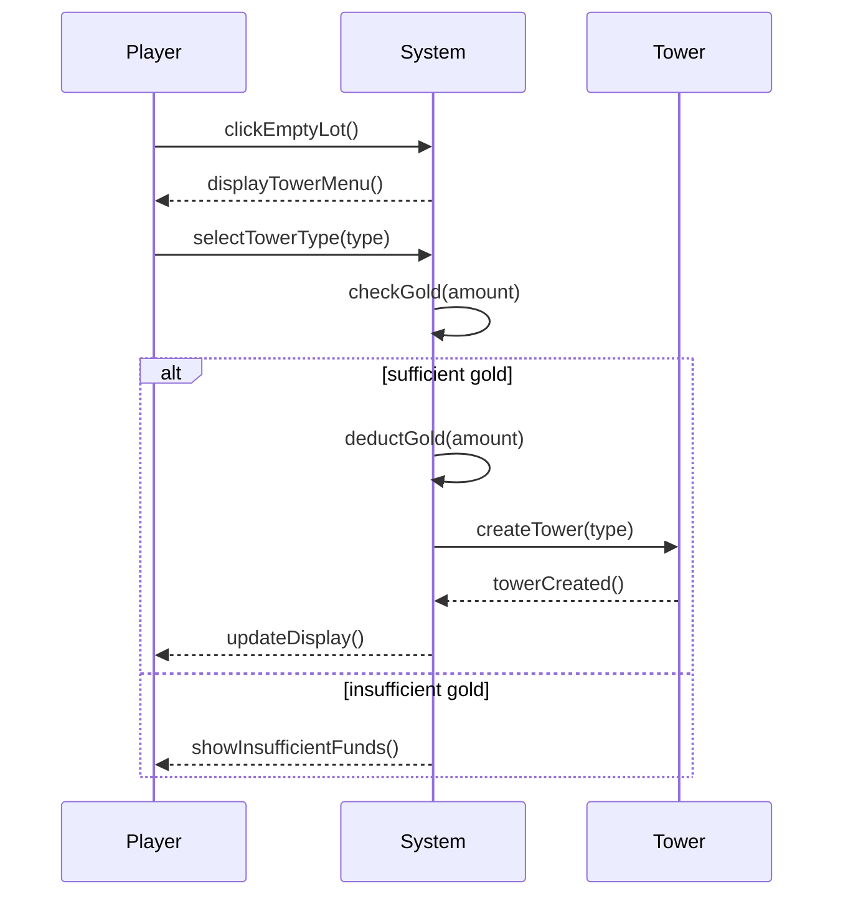
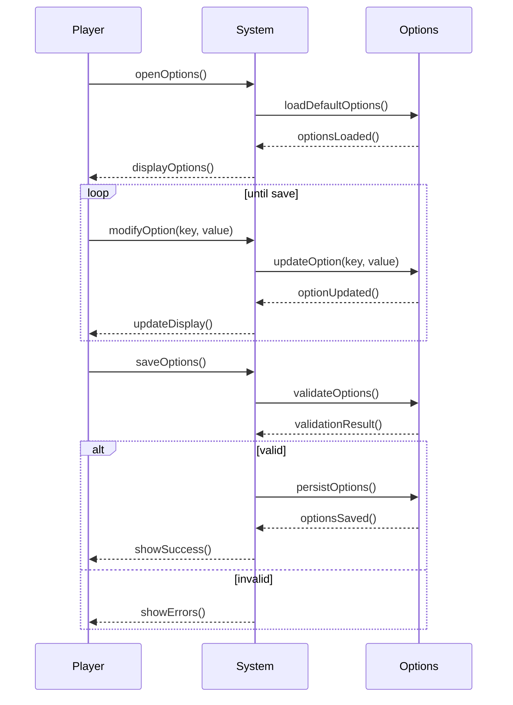
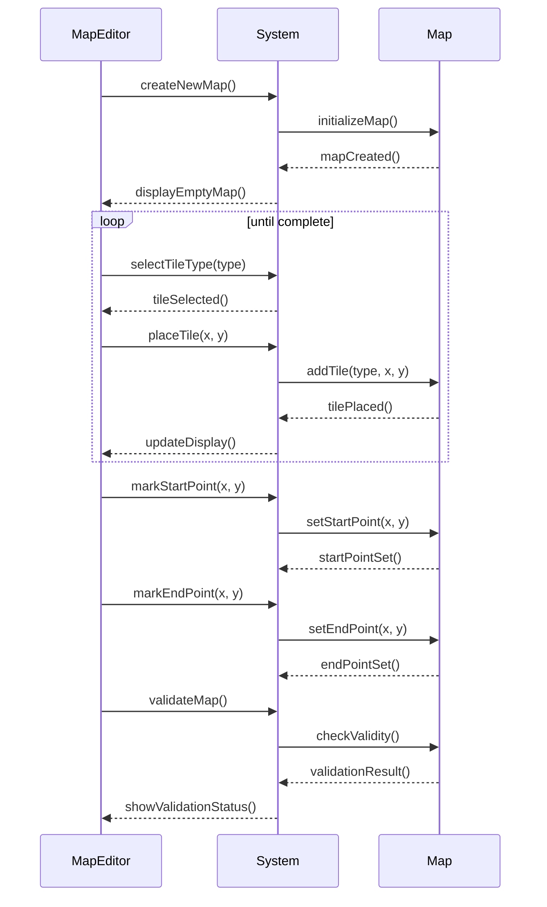
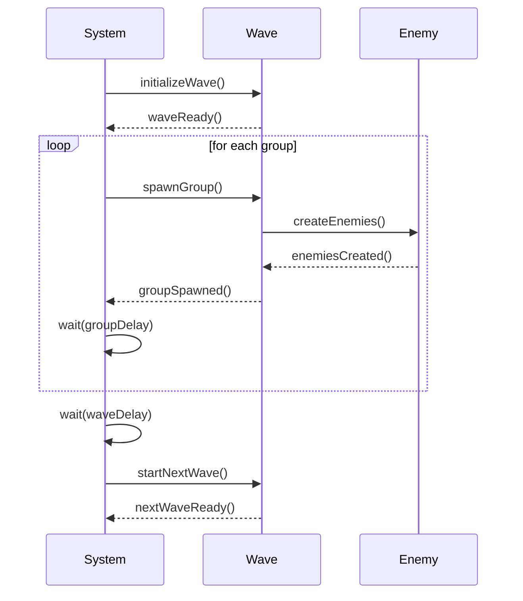
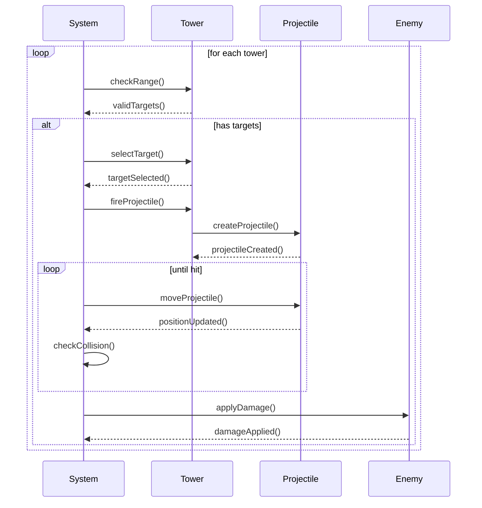
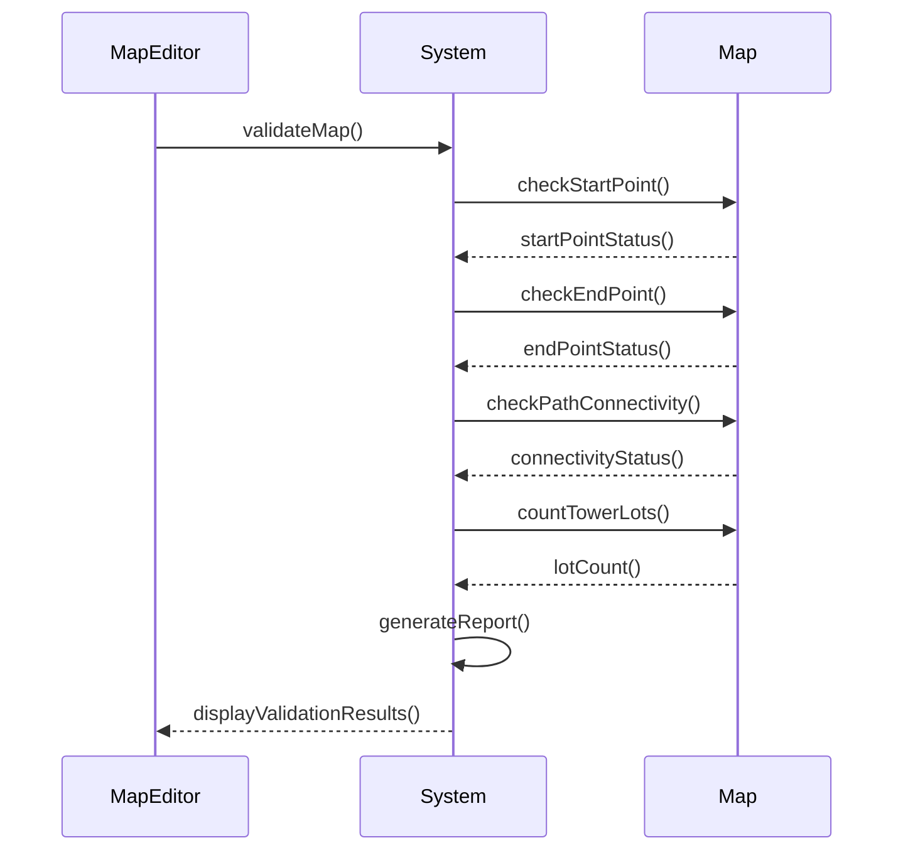
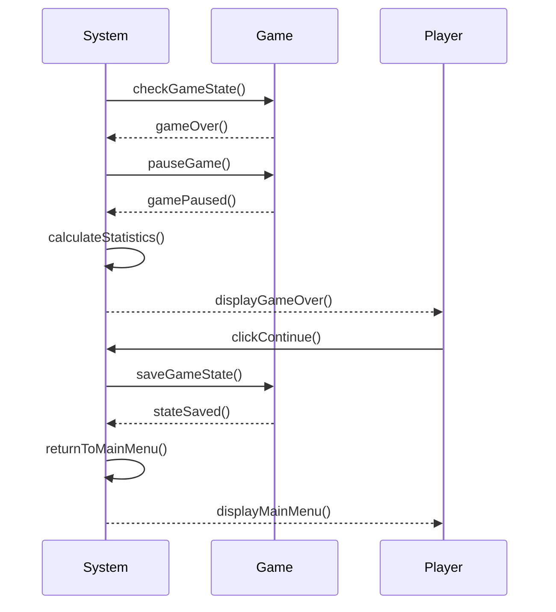

# KU Tower Defense - Phase 1 UML Documentation

## 1. Use Case Diagram

```mermaid
graph TD
    Player((Player))
    System((System))
    MapEditor((Map Editor))
    
    %% Main Menu Use Cases
    Player --> StartNewGame[Start New Game]
    Player --> OpenLevelEditor[Open Level Editor]
    Player --> OpenOptions[Open Options]
    Player --> QuitGame[Quit Game]
    
    %% Game Options Use Cases
    Player --> ConfigureGameOptions[Configure Game Options]
    System --> SaveOptions[Save Options]
    System --> LoadOptions[Load Options]
    
    %% Map Editor Use Cases
    MapEditor --> CreateMap[Create Map]
    MapEditor --> PlaceTiles[Place Tiles]
    MapEditor --> MarkStartPoint[Mark Start Point]
    MapEditor --> MarkEndPoint[Mark End Point]
    MapEditor --> ValidateMap[Validate Map]
    MapEditor --> SaveMap[Save Map]
    
    %% Gameplay Use Cases
    Player --> BuildTower[Build Tower]
    Player --> UpgradeTower[Upgrade Tower]
    Player --> SellTower[Sell Tower]
    Player --> PauseGame[Pause Game]
    Player --> ToggleGameSpeed[Toggle Game Speed]
    
    %% Enemy Management
    System --> SpawnEnemies[Spawn Enemies]
    System --> MoveEnemies[Move Enemies]
    System --> HandleEnemyDeath[Handle Enemy Death]
    System --> HandleEnemyReachEnd[Handle Enemy Reach End]
    
    %% Tower Management
    System --> TowerTargeting[Tower Targeting]
    System --> TowerAttack[Tower Attack]
    System --> ProjectileMovement[Projectile Movement]
```

## 2. Use Case Narratives

### 2.1 Build Tower
**Actor:** Player  
**Preconditions:** 
- Game is in play mode
- Player has sufficient gold
- Selected location is an empty tower lot
- Game is not paused

**Main Flow:**
1. Player clicks on an empty tower lot
2. System displays tower selection popup menu
3. Player selects tower type (Archer/Artillery/Mage)
4. System verifies player has sufficient gold
5. System deducts tower cost from player's gold
6. System places selected tower on the lot
7. System enables tower targeting and attack capabilities

**Alternative Flows:**
- 3a. Player clicks outside popup menu
  - System closes popup menu without placing tower
- 4a. Player has insufficient gold
  - System displays insufficient funds message
  - System closes popup menu

**Postconditions:**
- New tower is placed on the map
- Player's gold is reduced by tower cost
- Tower is ready to target and attack enemies

### 2.2 Configure Game Options
**Actor:** Player  
**Preconditions:** 
- Game is in options screen
- Default values are loaded

**Main Flow:**
1. Player modifies wave settings
2. Player modifies enemy settings
3. Player modifies tower settings
4. Player modifies gold and health settings
5. Player clicks save button
6. System validates all settings
7. System saves settings to persistent storage

**Alternative Flows:**
- 6a. Invalid settings detected
  - System displays error message
  - System highlights invalid fields
- 7a. Player clicks reset to defaults
  - System restores default values
  - System clears all custom settings

**Postconditions:**
- All game settings are updated
- Settings are persisted for future sessions
- Game is ready to use new settings

### 2.3 Create Map
**Actor:** Map Editor  
**Preconditions:** 
- Map editor is open
- New map is initialized

**Main Flow:**
1. Map Editor selects path tile
2. Map Editor places path tiles from start to end
3. Map Editor places empty tower lots
4. Map Editor places decorative tiles
5. Map Editor marks start point
6. Map Editor marks end point
7. Map Editor validates map
8. Map Editor saves map

**Alternative Flows:**
- 7a. Invalid map configuration
  - System displays validation errors
  - Map Editor fixes issues
- 8a. Map Editor cancels
  - System discards changes
  - Returns to main menu

**Postconditions:**
- Valid map is created and saved
- Map contains required elements
- Map is ready for gameplay

### 2.4 Handle Enemy Wave
**Actor:** System  
**Preconditions:** 
- Game is in play mode
- Wave timer has expired
- Previous wave is complete

**Main Flow:**
1. System initializes new wave
2. System spawns first group of enemies
3. System waits for group delay
4. System spawns next group
5. System repeats until all groups spawned
6. System waits for wave delay
7. System starts next wave

**Alternative Flows:**
- 3a. Game is paused
  - System pauses wave progression
  - System resumes when unpaused
- 6a. No more waves
  - System triggers game victory
  - System returns to main menu

**Postconditions:**
- All enemies in wave are spawned
- Wave progression is tracked
- Next wave is ready to begin

### 2.5 Tower Combat System
**Actor:** System  
**Preconditions:** 
- Game is in play mode
- Towers are placed on map
- Enemies are present

**Main Flow:**
1. System checks tower ranges
2. System identifies valid targets
3. System selects farthest progressed enemy
4. System calculates projectile path
5. System spawns projectile
6. System moves projectile
7. System applies damage on hit

**Alternative Flows:**
- 2a. No valid targets in range
  - System skips tower this cycle
- 7a. Enemy dies
  - System awards gold to player
  - System removes enemy

**Postconditions:**
- Projectiles are properly tracked
- Damage is correctly applied
- Combat cycle is complete

### 2.6 Validate Map
**Actor:** Map Editor  
**Preconditions:** 
- Map is fully created
- All tiles are placed

**Main Flow:**
1. Map Editor requests validation
2. System checks start point position
3. System checks end point position
4. System verifies path connectivity
5. System counts empty tower lots
6. System generates validation report
7. System indicates validation status

**Alternative Flows:**
- 3a. Start/End not on edge
  - System marks invalid positions
- 4a. Path not connected
  - System highlights disconnected sections
- 5a. Insufficient tower lots
  - System indicates minimum required

**Postconditions:**
- Map validation status is known
- Any issues are clearly identified
- Map is ready for saving if valid

### 2.7 Handle Game Over
**Actor:** System  
**Preconditions:** 
- Player has 0 hit points remaining
- OR all waves are completed

**Main Flow:**
1. System detects game over condition
2. System pauses gameplay
3. System displays game over banner
4. System shows final statistics
5. System waits for player input
6. System returns to main menu

**Alternative Flows:**
- 1a. Victory condition
  - System displays victory message
  - System shows victory statistics
- 5a. Player requests restart
  - System initializes new game
  - System loads current map

**Postconditions:**
- Game state is properly saved
- Player is returned to main menu
- Statistics are preserved

## 3. System Sequence Diagrams

### 3.1 Build Tower SSD

### 3.2 Configure Game Options SSD

### 3.3 Create Map SSD

### 3.4 Handle Enemy Wave SSD

### 3.5 Tower Combat System SSD

### 3.6 Validate Map SSD

### 3.7 Handle Game Over SSD

## 4. Operation Contracts

### 4.1 Build Tower
**Operation:** buildTower(type: TowerType, location: Point)  
**Cross References:** Use Cases: Build Tower  
**Preconditions:**
- Game is in play mode
- Location is an empty tower lot
- Player has sufficient gold for tower type
- Game is not paused

**Postconditions:**
- New tower instance created
- Tower placed at specified location
- Player's gold reduced by tower cost
- Tower targeting system initialized
- Tower attack system initialized

### 4.2 Configure Game Options
**Operation:** saveGameOptions(options: GameOptions)  
**Cross References:** Use Cases: Configure Game Options  
**Preconditions:**
- All option values are within valid ranges
- Required options are present
- No conflicting options exist

**Postconditions:**
- Game options updated with new values
- Options persisted to storage
- Default values preserved
- Game state updated to reflect new options

### 4.3 Create Map
**Operation:** createMap(width: int, height: int)  
**Cross References:** Use Cases: Create Map  
**Preconditions:**
- Width and height are positive integers
- Map editor is in edit mode
- No existing unsaved changes

**Postconditions:**
- New map instance created
- Map grid initialized
- Start and end points unset
- Map validation status set to invalid
- Map ready for tile placement

### 4.4 Handle Enemy Wave
**Operation:** spawnWave(waveNumber: int)  
**Cross References:** Use Cases: Handle Enemy Wave  
**Preconditions:**
- Game is in play mode
- Previous wave is complete
- Wave number is valid
- Start point is defined

**Postconditions:**
- Wave initialized with correct parameters
- Enemy groups created
- Spawn timers initialized
- Wave progression tracking started
- Next wave prepared

### 4.5 Tower Combat System
**Operation:** processTowerCombat()  
**Cross References:** Use Cases: Tower Combat System  
**Preconditions:**
- Game is in play mode
- Towers are placed on map
- Enemies exist on map
- Game is not paused

**Postconditions:**
- All towers processed
- Valid targets identified
- Projectiles created and moved
- Damage applied to enemies
- Combat cycle completed

### 4.6 Validate Map
**Operation:** validateMap(map: GameMap)  
**Cross References:** Use Cases: Validate Map  
**Preconditions:**
- Map is fully created
- All required tiles placed
- Start and end points marked
- Map dimensions are valid

**Postconditions:**
- Start point validation complete
- End point validation complete
- Path connectivity verified
- Tower lot count verified
- Validation report generated

### 4.7 Handle Game Over
**Operation:** processGameOver()  
**Cross References:** Use Cases: Handle Game Over  
**Preconditions:**
- Game is in play mode
- Player has 0 hit points OR all waves complete
- Game state is valid

**Postconditions:**
- Game paused
- Final statistics calculated
- Game over screen displayed
- Game state saved
- Return to main menu prepared

## 5. Vision Document

### 5.1 Problem Statement
The current tower defense game market lacks a customizable, educational-focused game that combines strategic thinking with engaging gameplay mechanics. KU Tower Defense aims to fill this gap by providing a platform where players can not only play but also create and customize their own levels.

### 5.2 Product Position Statement
For strategy game enthusiasts who want a customizable tower defense experience, KU Tower Defense is a Java-based game that combines classic tower defense mechanics with a powerful level editor, unlike other games in the genre that offer limited customization options.

### 5.3 Stakeholder and User Descriptions
**Primary Stakeholders:**
- Players: Strategy game enthusiasts
- Developers: Java development team
- Educators: Using the game for educational purposes

**User Types:**
- Casual Players: Enjoying the core gameplay
- Level Designers: Creating custom maps
- Strategic Players: Optimizing tower placement

### 5.4 Product Features
- Customizable game options
- Level editor with validation
- Three unique tower types
- Two distinct enemy types
- Wave-based enemy spawning
- Persistent game settings
- Visual feedback systems

## 6. Supplementary Specification

### 6.1 Usability
- Intuitive mouse-based controls
- Clear visual feedback for all actions
- Responsive UI with no lag
- Consistent interface across all screens
- Helpful tooltips and tutorials

### 6.2 Reliability
- Auto-save functionality
- Crash recovery
- Data validation
- Error handling
- State persistence

### 6.3 Performance
- 60 FPS gameplay
- Smooth enemy movement
- Responsive tower targeting
- Efficient path finding
- Quick map loading

### 6.4 Supportability
- Modular code structure
- Comprehensive documentation
- Debug logging
- Error reporting
- Configuration management

## 7. Glossary

### 7.1 Core Concepts
- **Tower**: Defensive structure that attacks enemies
- **Enemy**: Unit that follows path to reach exit
- **Wave**: Group of enemies that spawn together
- **Path**: Route that enemies follow
- **Projectile**: Attack launched by towers

### 7.2 Game Elements
- **Archer Tower**: Fast-firing single-target tower
- **Artillery Tower**: Slow-firing AOE tower
- **Mage Tower**: Medium-speed magic tower
- **Goblin**: Fast, magic-resistant enemy
- **Knight**: Slow, arrow-resistant enemy

### 7.3 Technical Terms
- **AOE**: Area of Effect damage
- **FPS**: Frames Per Second
- **UI**: User Interface
- **SSD**: System Sequence Diagram
- **UML**: Unified Modeling Language 